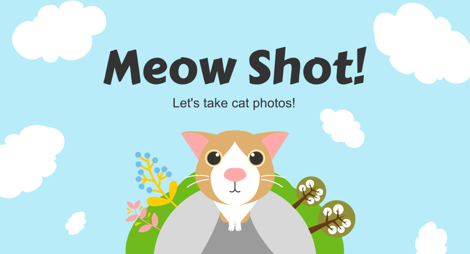
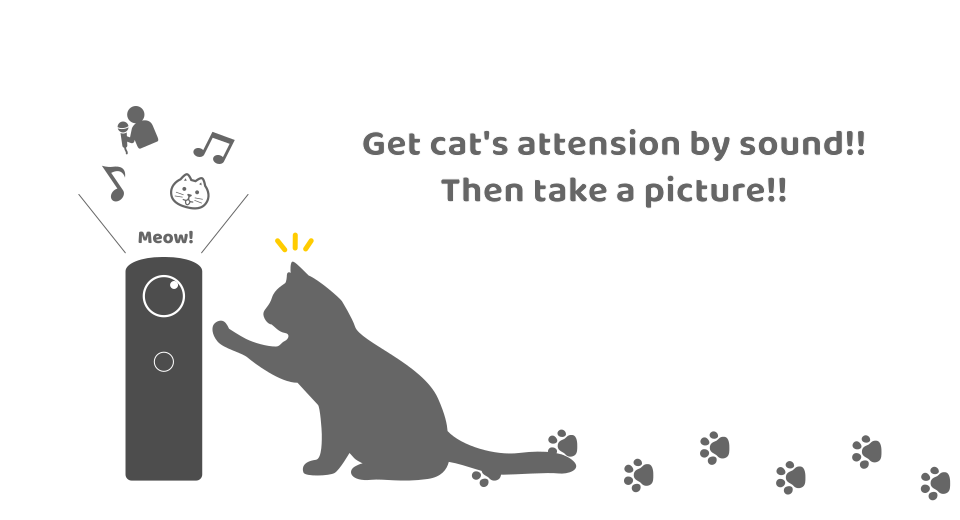
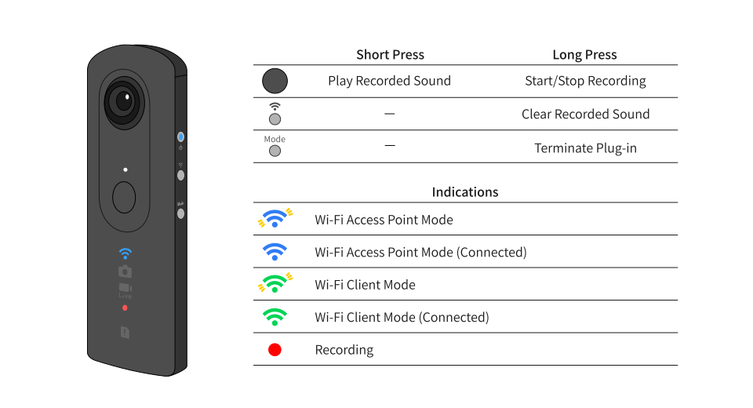
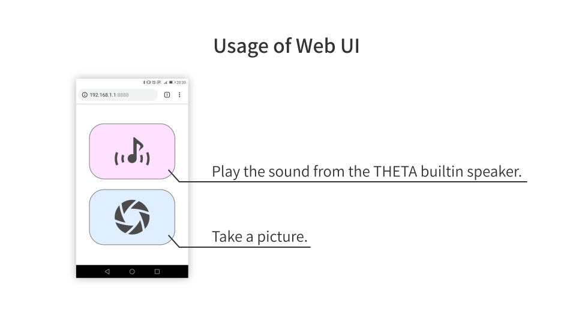

English(US) | [日本語](README.ja.md)

# Meow Shot!

shiro  
[Terms of Use](https://github.com/shrhdk/meowshot)

<table><tr><td></td><td></td><td></td><td></td></tr></table>

## Description

THETA plug-in supporting cat shooting.  
  
Get a cat's attention by a voice, and take a picture.  
  
This plug-in has three commands.  
* Take a 360 degree picture remotely.
* Play a cute cat voice from a speaker in THETA remotely.
* Record your voice using a microphone in THETA and use it instead of cat voice.
  
You don't need to install a smartphone app. Just need a web browser.  

## What's New

* Operation sounds except shutter sound are played even if shutter volume is muted.
* Turns Wi-Fi on as AP mode automatically if the Wi-Fi is turned off.
* Bug fix: The remote shutter does not work if the THETA is not in still image capture mode before the plug-in starts.

## Information

- Updated: 2019/6/5
- Version: 1.0.1
- Requires:
  - RICOH THETA Z1 (v1.03.5)
  - RICOH THETA V (v2.50.1, v3.00.1)
- Support: [Partner Plugins](https://github.com/shrhdk/meowshot)
- Age Restriction: No
