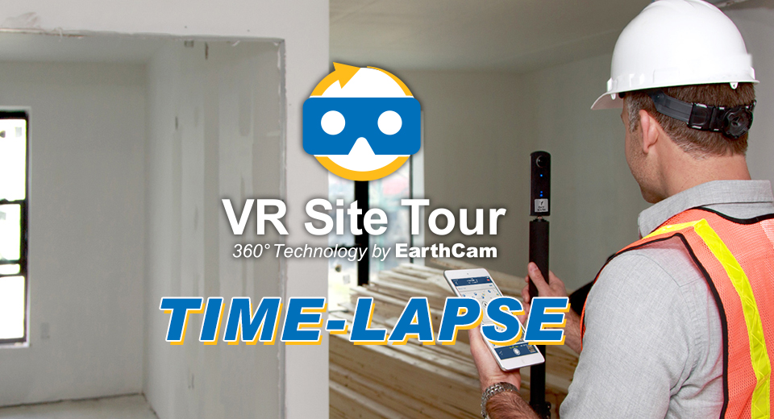
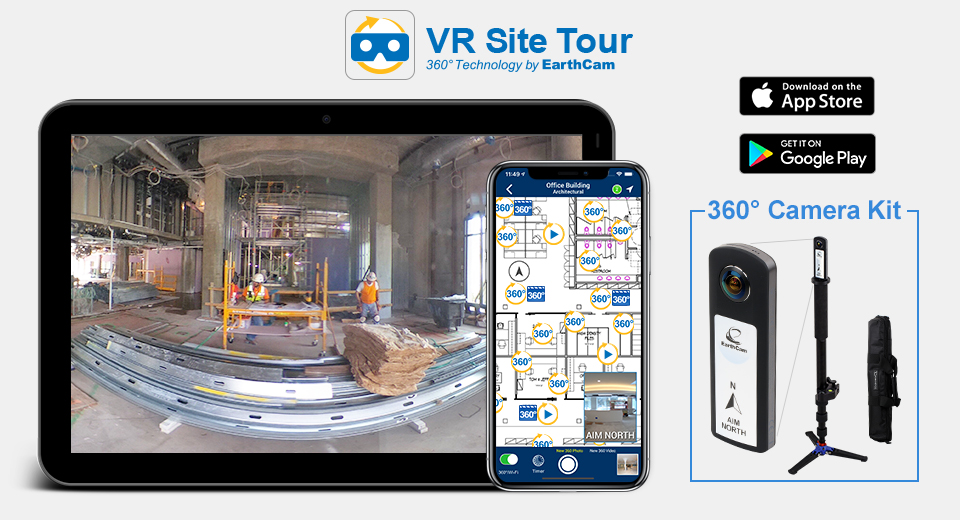
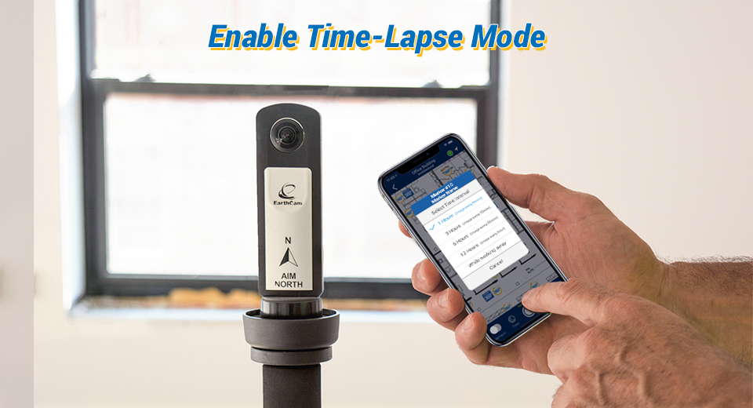
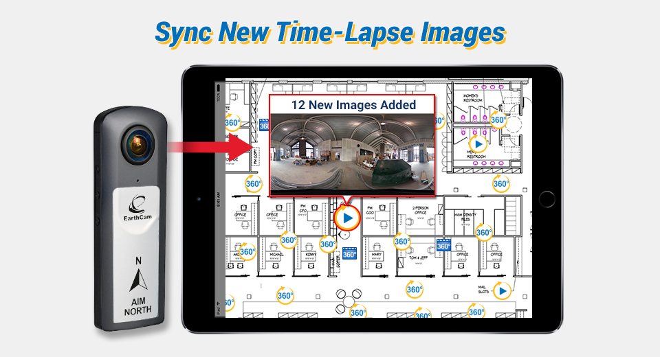
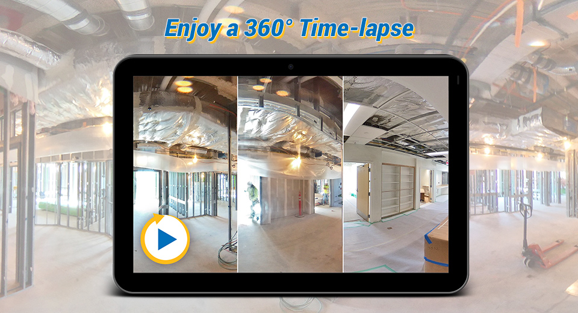

[English(US)](README.md) | 日本語

# VR Site Tour Time-Lapse
EarthCam  
[利用規約](https://cc8.earthcam.net/eula/web)

 
 <table>
  <tr>
   <td></td>
   <td></td>
   <td></td>
   <td></td>
  </tr>
 </table>

***

## 説明
Condense a day’s worth of work into seconds with EarthCam’s all-new VR Site Tour Time-Lapse plugin.  
  
Users of EarthCam’s VR Site Tour photography documentation app now have the ability to create short-term time-lapse videos with its all new plugin for Ricoh Theta 360° cameras, including the new Theta Z1. Quickly document jobsite progress and add the unique animated content to site plans for further insight into the project process. This site plan enhancement is an exciting and unique addition to VR Site Tour’s current collection of geo-tagged photography and video content.  
  
Designed specifically to be used in conjunction with EarthCam’s VR Site Tour app, the plugin creates a “hands-free approach”, allowing users to set their Ricoh Theta camera to take photos at scheduled intervals throughout the day. This plugin is perfect for documenting interiors and eliminates the need to continuously trigger the camera to take photos. Simply select the total period of time you would like photos to be captured for – and the app does it all for you! With the Advanced Mode, leverage the existing Wi-Fi network at your location, giving you free range to leave the jobsite without interrupting progress documentation. EarthCam’s service automatically converts a day’s worth of progress into quick, easy-to-share 10-second time-lapse video bursts and syncs them directly to site plans and BIM 3D models.  
  
Please note: The VR Site Tour Time-Lapse plugin is designed for EarthCam.net managed service customers and needs to be used in conjunction with EarthCam’s VR Site Tour photography documentation app.  
  
For more information, contact EarthCam today!  
  
## 新機能
Now, added support for Ricoh Theta Z1! Convert a day’s worth of work into seconds.  
* Create easy-to-share short-term time-lapse videos
* Sync directly to site plans and BIM 3D models

## 情報
  * 更新日：2019/7/10
  * バージョン：1.0.2
  * 要件：
    * RICOH THETA Z1 （ファームウェア バージョン 1.03.5）
    * RICOH THETA V （ファームウェア バージョン 2.50.1,3.00.1）
  * サポート：[Partner Plugins](https://www.earthcam.net/support/contactus.php?reason=11)
  * 年齢制限：なし

* プラグインをインストールするにはパソコン用基本アプリ [RICOH THETA](https://theta360.com/ja/about/application/pc.html#app-detail-01) が必要です
