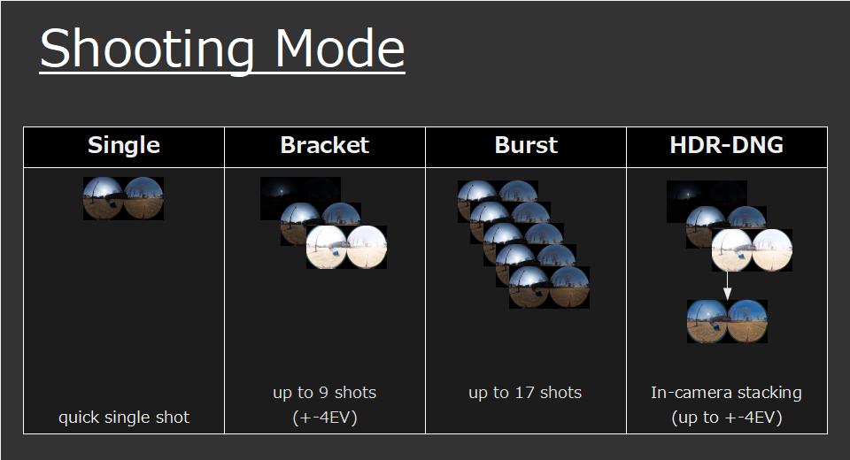
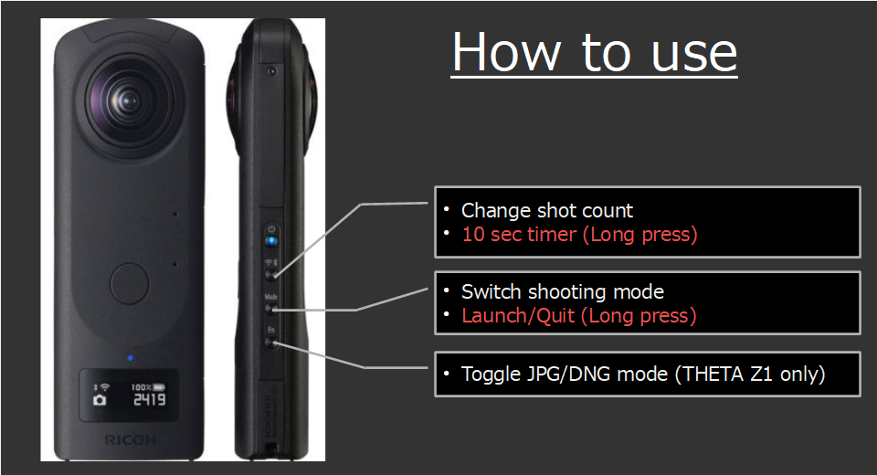
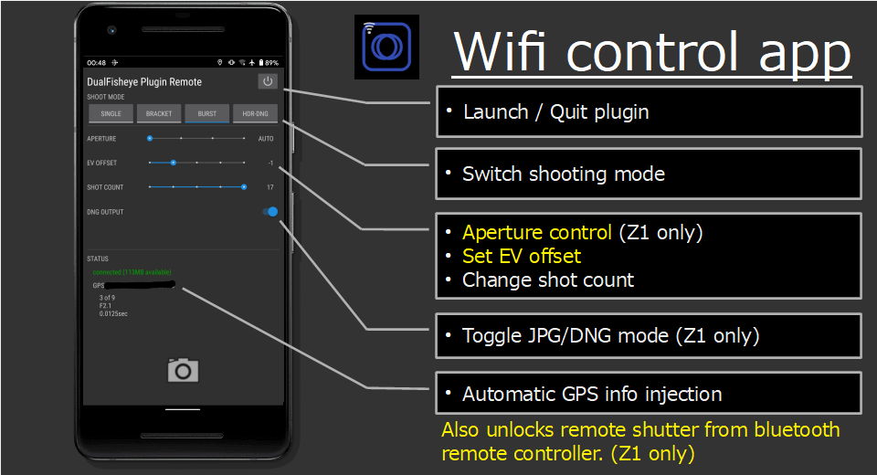
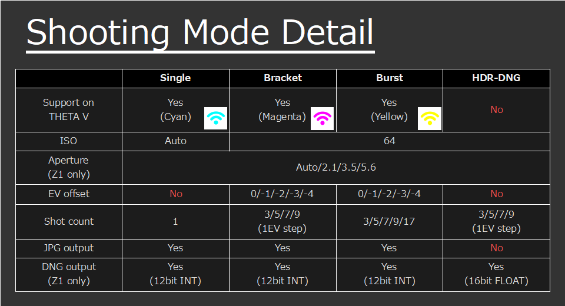
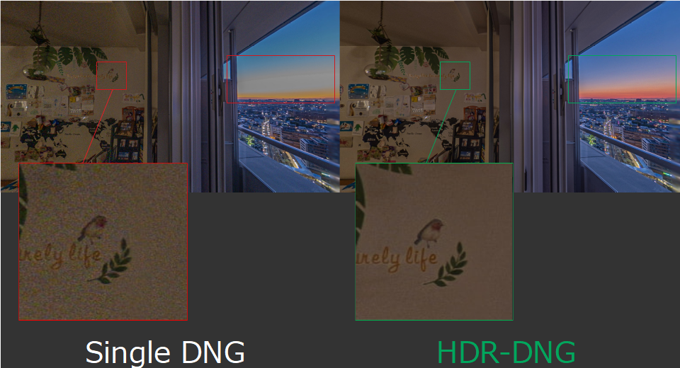

English(US) | [日本語](README.ja.md)

# DualFisheye Plugin
hirota41d  
[Terms of Use](https://sites.google.com/view/h360/dualfisheye-plugin)

 

 <table>
  <tr>
   <td></td>
   <td></td>
   <td></td>
   <td></td>
  </tr>
 </table>

***

## Description
The DualFisheye Plug-in allows you to take a single / multiple dual-fisheye 360 degree images more quickly with just 1 click of shutter button.  
  
1)In single shot mode, 1 shot takes about 1 second.  
2)Bracketing mode can take 3/5/7/9 shots at 1EV step.  
3)Burst mode can take 3/5/7/9/17 shots.  
4)HDR-DNG mode (Z1 only) can take 3/5/7/9 shots at 1EV step, then generates 16bit float HDR DNG image by stacking them. With only +20% extra file size, it can store much wider dynamic range, up to +/-4EV range.  
  
How to use   
* "Mode" button: toggles shooting mode  
* "Wifi" button: toggles number of shots  
* "Wifi" button (long press): toggles 10 sec timer on/off  
* "Fn" button (Z1 only): toggles JPG/DNG* mode  
  
*JPG takes ~1sec/shot  
*DNG takes more time, ~2.5sec/shot  
  
To speed up the process, the DualFisheye Plug-in keeps the two 180 degree fisheye images unstitched. Afterward, you can send them over to the processing devices (e.g. PC/Android) for batch processing (merging/stitching application is required).  
  
You can also control this plugin from your smartphone by using remote app, which features  
1) remote shutter from the app via wifi  
2) manual aperture control  
3) EV offset control  
4) injecting GPS location information  
5) remote shutter from bluetooth remote controller (bonus feature only for Z1)  
The remote app is available from here.  
https://play.google.com/store/apps/details?id=hirota41.com.dualfishcontroller  
    
## What's New
reduced pink noise error in HDR-DNG mode

## Information
  * Updated：2021/3/17
  * Version：2.12.0
  * Requires：
    * RICOH THETA Z1 (Firmware version 1.60.1,1.80.1)
    * RICOH THETA V (Firmware version 3.60.1)
  * Support：[Partner Plugins](https://sites.google.com/view/h360/top)
  * Age Restriction：No

* The [RICOH THETA](https://theta360.com/ja/about/application/pc.html#app-detail-01) basic app for computer is required to install plugins
