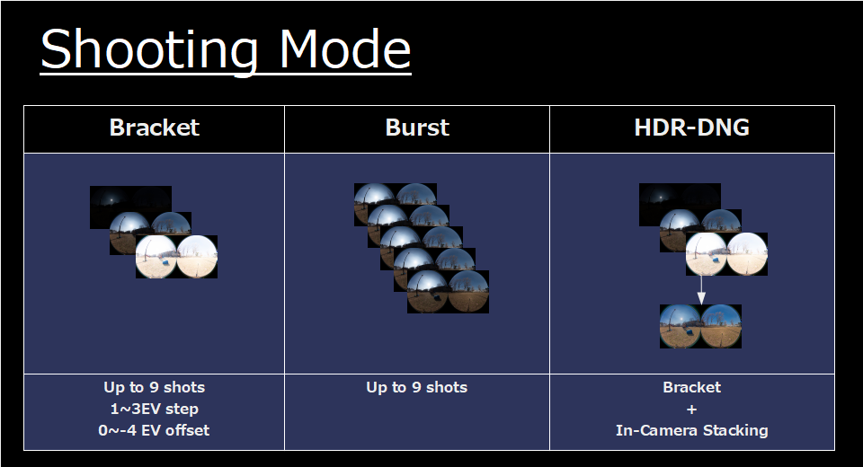
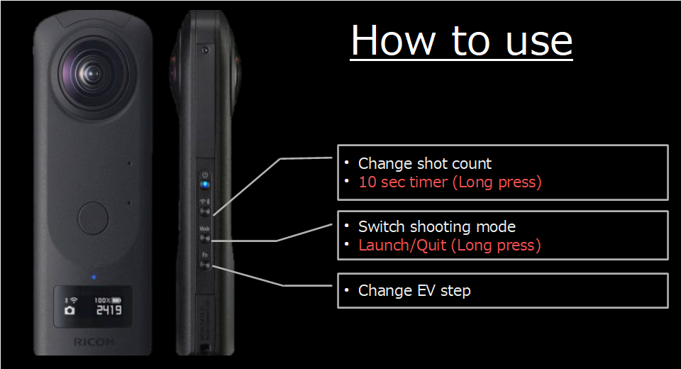
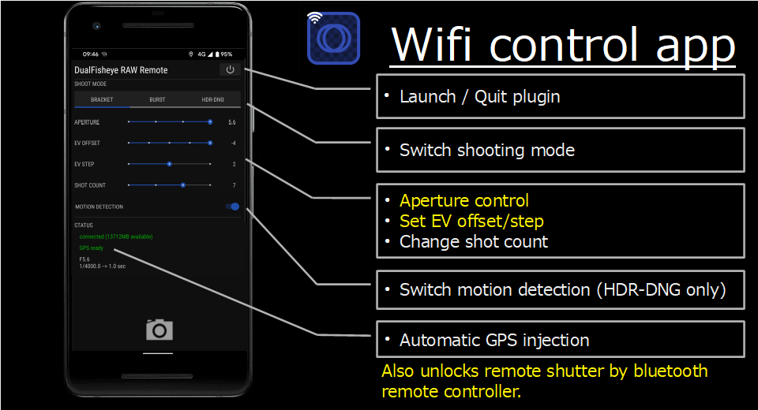
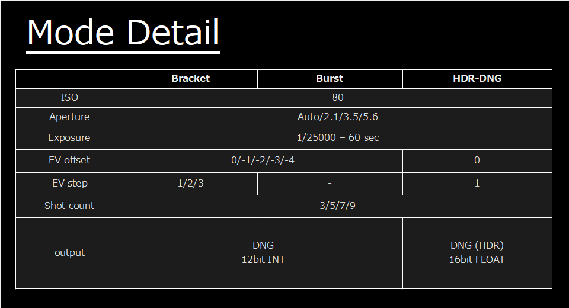
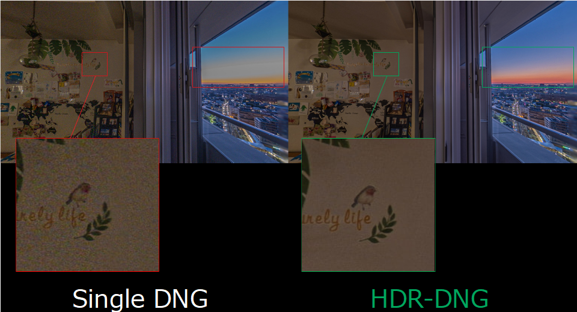

English(US) | [日本語](README.ja.md)

# DualFisheye RAW

hirota41d  
[Terms of Use](https://sites.google.com/view/h360/dualfisheye-raw)

<table><tr><td></td><td></td><td></td><td></td></tr></table>

## Description

This plugin allows you to take multiple RAW images very quickly with just one click.  
  
MODE  
* Bracket - 3/5/7/9 shots at 1/2/3EV step.
* Burst - 3/5/7/9 shots.
* HDR - 3/5/7/9 shots at 1EV step, then merged into single 16bit float HDR-DNG file.
  
HOW TO USE  
* "Mode" button: toggles shooting mode
* "Wifi" button: toggles number of shots
* "Wifi" button (long press): toggles 10 sec timer on/off
* "Fn" button: toggles EV step (remote app is required to unlock)
  
PERFORMANCE  
~75x faster than DualFisheye Plugin:  
* 3 shots - 0.10 sec~
* 5 shots - 0.17 sec~
* 7 shots - 0.23 sec~
* 9 shots - 0.30 sec~
  
  
To speed up the process, the DualFisheye Plug-in keeps the two 180 degree fisheye images unstitched. Afterward, you can send them over to the processing devices (e.g. PC/Android) for batch processing (merging/stitching application is required).  
  
You can also control this plugin from your android device by using remote app, which features  
1. remote shutter via wifi
2. manual aperture control
3. EV offset control
4. injecting GPS location information
5. remote shutter by bluetooth remote controller (bonus feature)
The remote app is available from here.  
https://play.google.com/store/apps/details?id=hirota41.com.dualfishcontrollerraw  

## What's New

- Solved flickering OLED display issue when controlled by remote app
- Improved remote app stability

## Information

- Updated: 2022/10/6
- Version: 1.1.1
- Requires:
  - RICOH THETA Z1 (v2.10.3)
- Support: [Partner Plugins](https://sites.google.com/view/h360/top)
- Age Restriction: No
