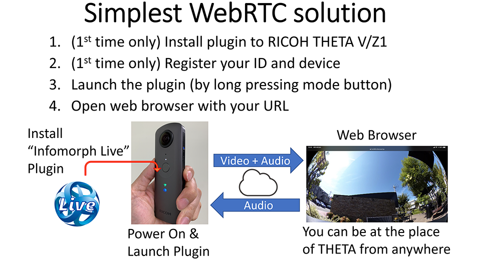
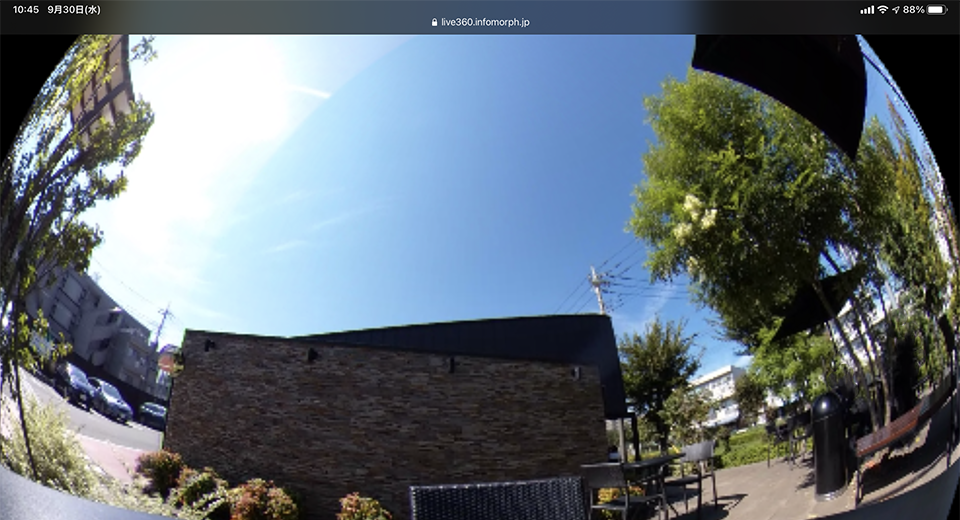

English(US) | [日本語](README.ja.md)

# Infomorph Live

Infomorph, Inc.  
[Terms of Use](https://sites.infomorph.jp/terms-of-use-infomorph-live)

<table><tr><td></td><td></td><td></td><td></td></tr></table>

## Description

This is the simplest plugin to stream 360 degrees video and audio in real-time. By registering your ID and your THETA devices, you can get the URL for your device. By using the URL, your friends can access live streaming on their smartphone’s or PC’s browser.  
  
It is so simple to start a live streaming. The live streaming will start by just launching the plugin after connecting THETA to Internet. This plugin uses WebRTC technology. WebRTC is the interactive communications technology which is used widely as a web conference technology. Therefore, you can talk between the THETA holder and the viewer.  
  
Caution  
This service is under preview and for personal use only. This service may stop suddenly or changed. This service supposes the use-case as single P2P session like 1:1 meeting, and up to 1-hour session. We do NOT suppose using this service for a long term as several hours, using many hours in a month for a user or accessing from multiple browsers at the same time. If user uses such a long live streaming, we may stop the service without advance notice. In such use case, we recommend using YouTube live streaming by using Live Streaming Plugin provided from Ricoh.  
If you think to use this service in your business, please ask us.  

## Information

- Updated: 2020/10/21
- Version: 0.9.6
- Requires:
  - RICOH THETA Z1 (v1.50.1)
  - RICOH THETA V (v3.40.1)
- Support: [Partner Plugins](https://sites.infomorph.jp/infomorph-live)
- Age Restriction: Yes
