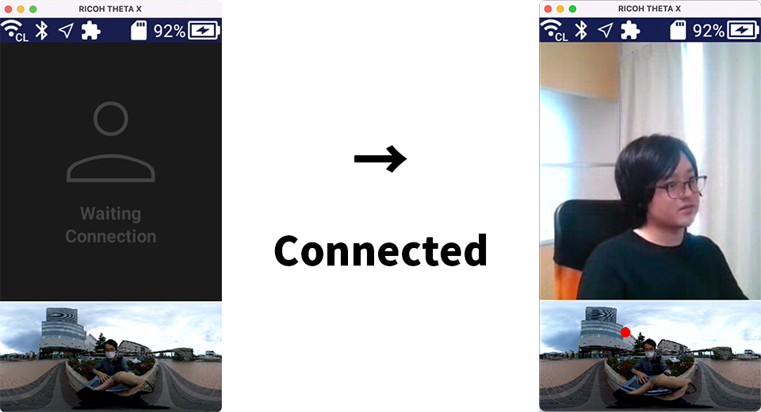
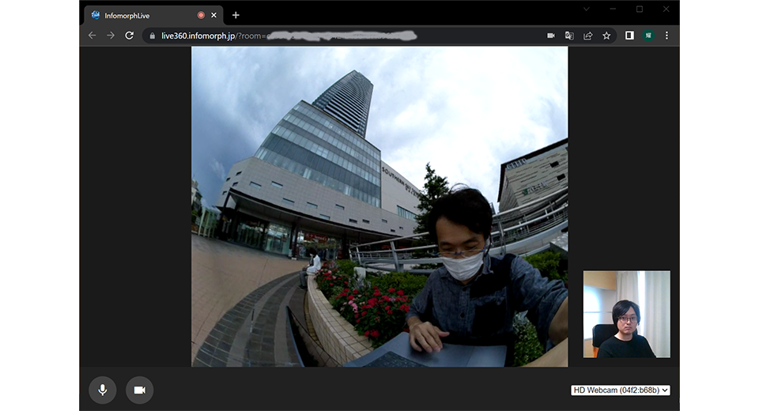
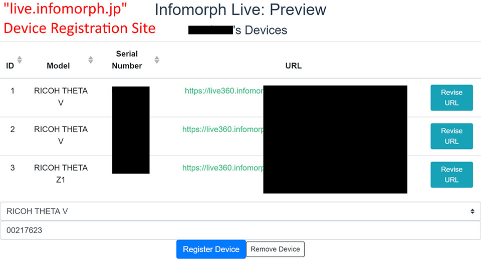

English(US) | [日本語](README.ja.md)

# Infomorph Live X

Infomorph, Inc.  
[Terms of Use](https://sites.infomorph.jp/terms-of-use-infomorph-live)

<table><tr><td></td><td></td><td></td><td></td></tr></table>

## Description

This plugin makes 360 degree video chat easy. You can get the URL for video chat by registering your THETA on our website. Through the URL, you will be able to have a 360-degree video chat with THETA on your smartphone or PC browser.

## Information

- Updated: 2022/11/7
- Version: 1.0.0
- Requires:
  - RICOH THETA X (v1.00.2, v1.10.1, v1.20.0)
- Support: [Partner Plugins](https://sites.infomorph.jp/infomorph-live)
- Age Restriction: No
