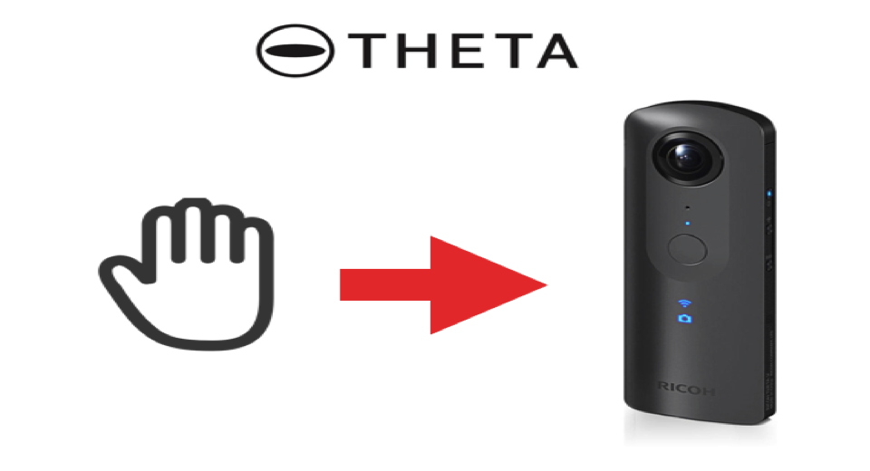
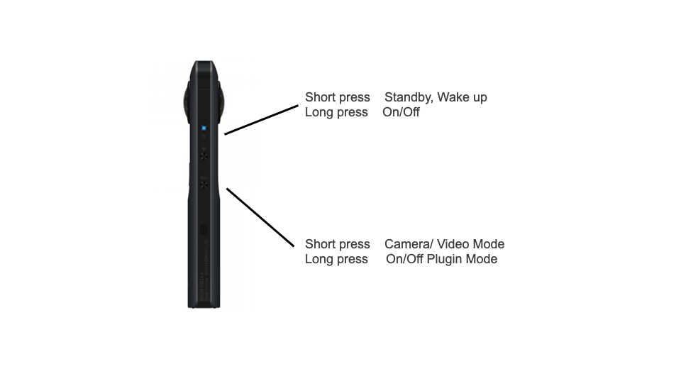

English(US) | [日本語](README.ja.md)

# Gesture Theta
Invtos  
[Privacy Policy](../../README.md#privacy-policy) | [Terms of Services](../../README.md#terms-of-services)

 

 <table>
  <tr>
   <td></td>
   <td></td>
   <td></td>
   <td></td>
  </tr>
 </table>

***

## Description
Theta will automatic shoot picture with 5 seconds delay when detecting hand
  
  
## Information
  * Updated：2019/8/7
  * Version：1.0.0
  * Requires：
    * RICOH THETA V (Firmware version 3.00.1)
  * Support：[Partner Plugins](https://github.com/wtos03/gesture_theta)
  * Age Restriction：No

* The [RICOH THETA](https://theta360.com/ja/about/application/pc.html#app-detail-01) basic app for computer is required to install plugins
