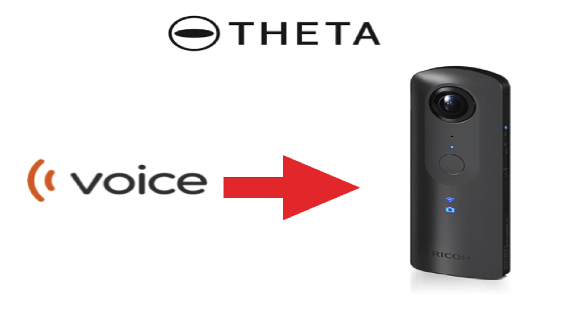

[English(US)](README.md) | 日本語

# Voice Theta

Invtos  
[利用規約](https://www.apache.org/licenses/LICENSE-2.0)

<table><tr><td></td><td></td><td></td><td></td></tr></table>

## 説明

Use Voice to activate theta camera shuttle. By saying word “on” Theta will begin to take picture within 5 seconds.

## 情報

- 更新日: 2019/7/31
- バージョン: 1.0.0
- 要件:
  - RICOH THETA V (v3.00.1)
- サポート: [Partner Plugins](https://github.com/wtos03/voice_theta)
- 年齢制限: なし
