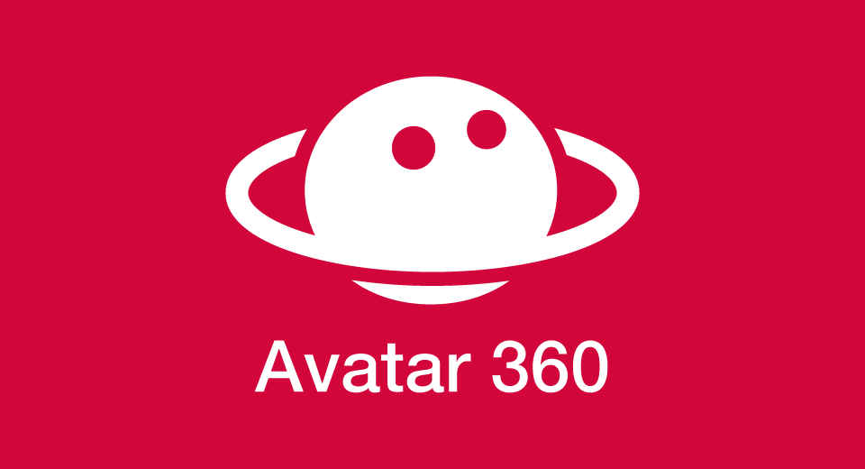

English(US) | [日本語](README.ja.md)

# Avatar360Theta
iPresence  
[Privacy Policy](../../README.md#privacy-policy) | [Terms of Services](../../README.md#terms-of-services)

 

 <table>
  <tr>
   <td></td>
   <td></td>
   <td></td>
   <td></td>
  </tr>
 </table>

***

## Description
By attached THETA to a remote-controllable Temi robot and using the Avatar360 app to remotely control the temi robot from a remote location, you can view the 360 panoramic view while on the move. By using RICOH's LiveStreaming service, which is highly compatible with THETA, high quality service can be provided.

## What's New
Bandwidth settings for THETA streaming are now available.

## Information
  * Updated：2021/8/6
  * Version：1.1.4
  * Requires：
    * RICOH THETA Z1 (Firmware version 1.80.1)
    * RICOH THETA V (Firmware version 3.60.1)
  * Support：[Partner Plugins](https://avatar360.web.app/#/)
  * Age Restriction：No

* The [RICOH THETA](https://theta360.com/ja/about/application/pc.html#app-detail-01) basic app for computer is required to install plugins
