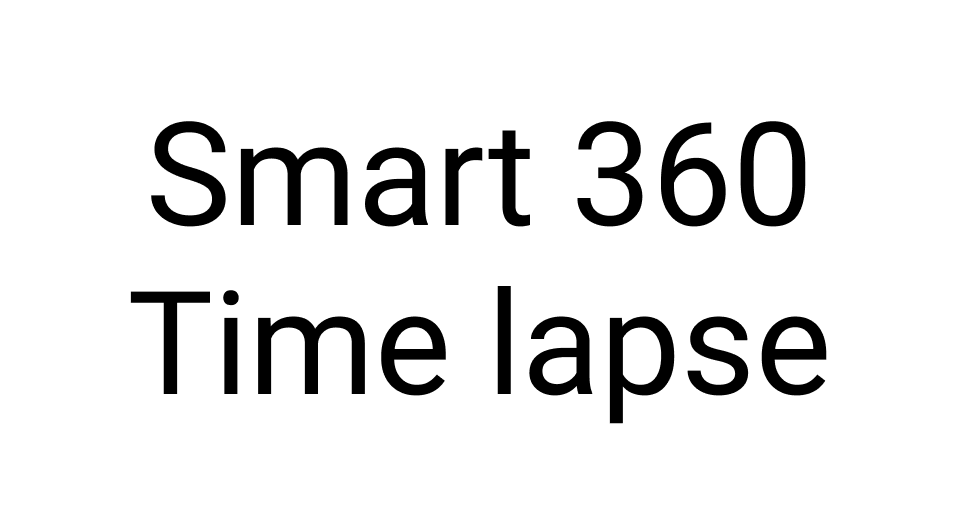

English(US) | [日本語](README.ja.md)

# Smart 360 Time Lapse

Nossa  
[Terms of Use](https://nossa360biz.com/plugin_term)

<table><tr><td></td><td></td><td></td><td></td></tr></table>

## Description

An application for taking interval shots and uploading the photos to the cloud.

## What's New

Addition of shooting mode

## Information

- Updated: 2021/10/26
- Version: 1.3.0
- Requires:
  - RICOH THETA Z1 (v2.00.1)
  - RICOH THETA V (v3.70.1)
- Support: [Partner Plugins](https://nossa360biz.com/support)
- Age Restriction: No
