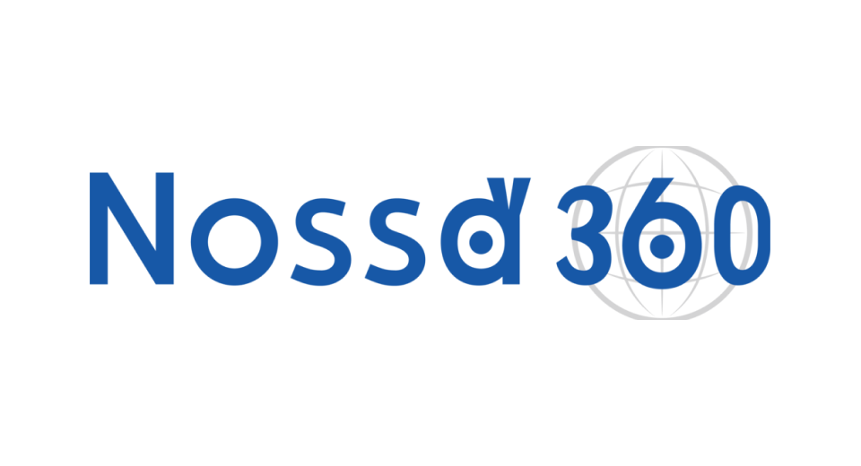

[English(US)](README.md) | 日本語

# Nossa360biz
Nossa, inc.  
[利用規約](https://nossa360biz.com/plugin_term)

 
 <table>
  <tr>
   <td></td>
   <td></td>
   <td></td>
   <td></td>
  </tr>
 </table>

***

## 説明
Nossa360 is a telecommunications system, enables participants to communicate while sharing spatial information.

## 新機能
Addition of exposure adjustment function

## 情報
  * 更新日：2022/8/5
  * バージョン：5.0.1
  * 要件：
    * RICOH THETA Z1 （ファームウェア バージョン 2.00.1）
    * RICOH THETA V （ファームウェア バージョン 3.70.1）
  * サポート：[Partner Plugins](https://nossa360biz.com/support)
  * 年齢制限：なし

* プラグインをインストールするにはパソコン用基本アプリ [RICOH THETA](https://theta360.com/ja/about/application/pc.html#app-detail-01) が必要です
