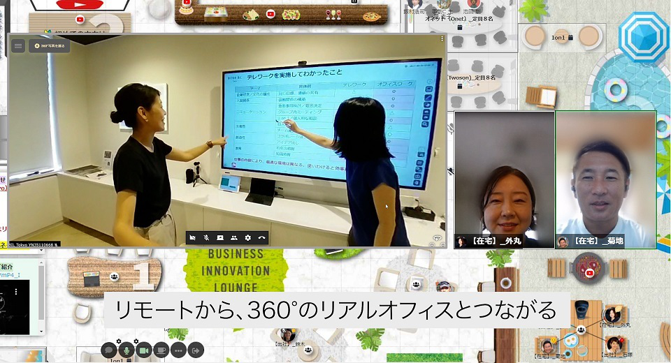
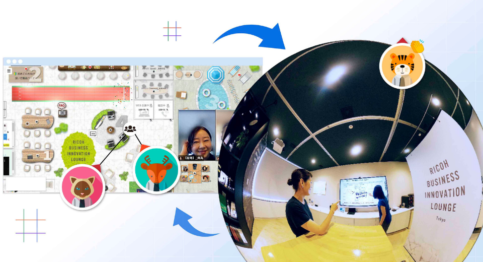

English(US) | [日本語](README.ja.md)

# Theta Live Streaming for oVice

oVice, Inc.  
[Terms of Use](https://www.ricoh360.com/terms/plugins/)

<table><tr><td></td><td></td><td></td><td></td></tr></table>

## Description

This plug-in enables 360° video streaming on the virtual space "oVice".  
By placing a THETA object on oVice and scanning the QR code displayed on the object with THETA, the object will be ready for streaming.  
When a user on the “oVice" clicks on the THETA object and connects it with a line or approaching the THETA object, streaming will begin.  

# What's New

Added the ability to start live streaming by simply approaching a THETA object.  
The method of starting live streaming can be selected when creating a THETA object on oVice.  

## Information

- Updated: 2022/3/8
- Version: 0.3.0
- Requires:
  - RICOH THETA Z1 (v1.80.1, v2.00.1)
- Support: [Partner Plugins](https://www.notion.so/ovice/RICOH-THETA-63b0ce489fb74eefa233f8838c2bd1d0)
- Age Restriction: No
