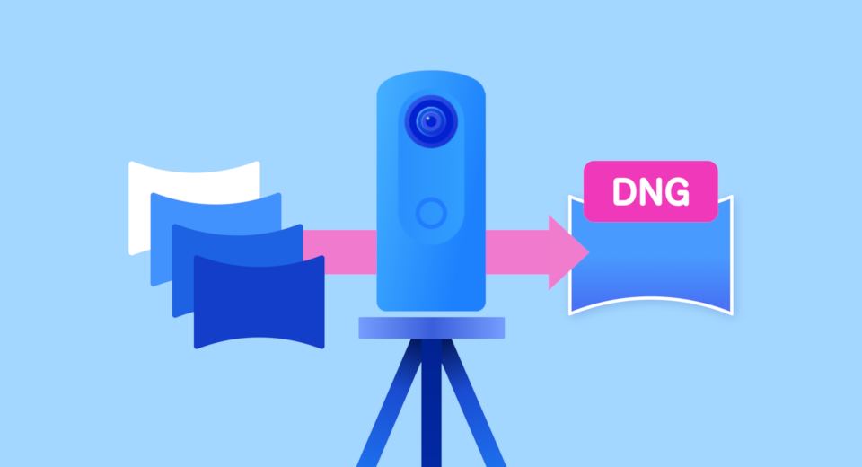
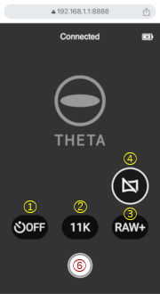
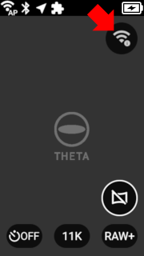
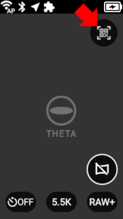

[English(US)](README.md) | 日本語

# HDR-DNG
Ricoh Company, Ltd.  
[Terms of Use](https://theta360.com/en/legal/terms_of_use_plugins/)

 

 <table>
  <tr>
   <td></td>
   <td></td>
   <td></td>
   <td></td>
  </tr>
 </table>

***

## 説明

RICOH THETA X 専用のHDR-DNGは、4枚のRAW画像をTHETA X内部で自動的にHDR処理しHDR-DNGフォーマットで出力するプラグインです。

撮影した360度画像の「質感統一」「明暗差の正確な表現」「撮影・編集時間の短縮」を可能とします。画像編集のポテンシャルの高さに加え、高精細な画質を実現する11Kで撮影できます。

## インストール方法

HDR-DNGはTHETA Xファームウェアv2.61.0以降にプリインストールされています。  
https://support.theta360.com/ja/download/firmware/x/

## 起動方法

THETA Xの撮影画面で左方向にスワイプしてプラグイン選択画面を表示し、「HDR-DNG」をタップします。詳細は[こちら](https://support.theta360.com/ja/manual/x/content/menu-plugin.html)を参照して下さい。

  

## 操作方法

### 本体UI

  

> * シャッターボタン：撮影  
> * Modeボタン：無線LAN OFF/ON  
> * ① セルフタイマー：OFF/5秒  
> * ② 画像サイズ：11K/5.5K (\*1)(\*2)  
> * ③ 画像フォーマット：Raw+Jpeg/Raw  
> * ④ プレビュー表示: OFF/ON (\*3)  
> * ⑤ QRコード表示  

### WebUI

  

> * ⑥ シャッターボタン：撮影  

### 無線簡単接続

QRコードを介して無線LANの簡単接続、及びWebUIへの簡単接続を行うことができます。  

#### 無線LANが未接続の場合  

⑤のアイコンをタップすると、THETA Xに無線LANで接続する為のQRコードが表示されます。スマートフォンのカメラでこのQRコードを撮影することで簡単に無線LANでの接続が完了します。    

 
  

#### 無線LANが接続済みの場合  

⑤のアイコンをタップすると、WebUIに接続する為のQRコードが表示されます。スマートフォンのカメラでこのQRコードを撮影することで簡単にWebUIへの接続が完了します。   

 
  

※「QRコード」は株式会社デンソーウェーブの登録商標です。

### 備考

- Bluetoothリモコンを利用して撮影することも可能です。利用するにはPluginを起動する前に事前にペアリングしておく必要があります。  
- (\*1) HDR-DNGのファイルサイズは、11Kで約115MB、5.5Kで約28.8MBです。  
- (\*2) 撮影完了までに掛かる処理時間は、撮影シーンにより変わりますが、11Kで約10秒間、5.5Kで約5秒間です。  
- (\*3) プレビューOFFにすると消費電力が減るのでバッテリー寿命を長く持たせることができますが、撮影完了までに掛かる時間が約2秒長くなります。  
- 本プラグインで撮影したJPEG画像は、プラグインを終了して再生画面を開き確認することができます。但し、HDR-DNGはTHETA X本体で再生することはできません。HDR-DNGを再生して確認する場合は、THETA XとPCをUSBケーブルで接続して、PCにてフォルダを開いて確認して下さい。  
　- 参考：[サムネイルを表示する](https://support.theta360.com/ja/manual/x/content/playback/playback_01.html)  

### 参考

- [THETA Xの最新プラグイン 「HDR-DNG」のご利用手順について](http://blog.ricoh360.com/jp/howtouse-thetax-hdrdng-plugin)

## 情報

* 更新日：2024/09/18
* バージョン：1.0.1
* 要件：
  * RICOH THETA X (Firmware version 2.61.0)
* サポート：[THETA Support](https://support-theta.ricoh360.com/)
* 年齢制限：なし

[def]: "assets/"
