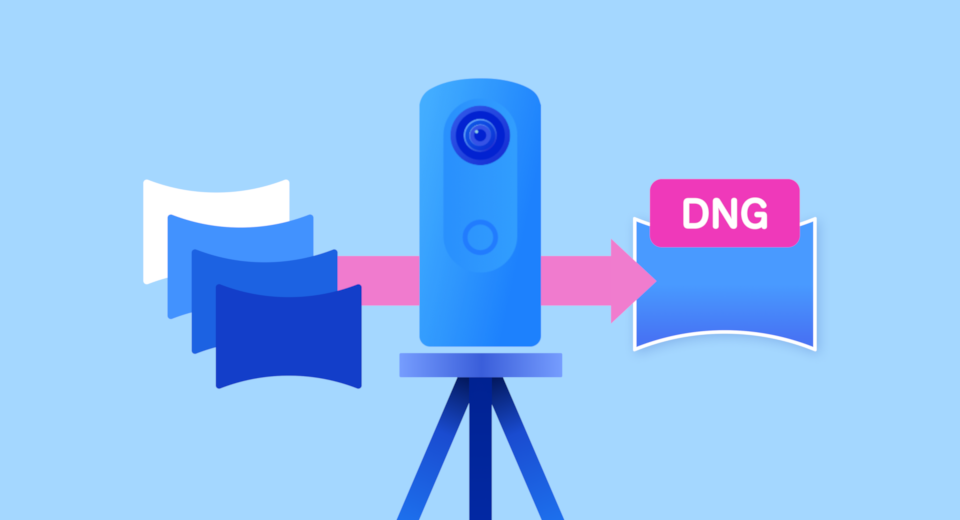
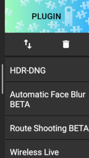
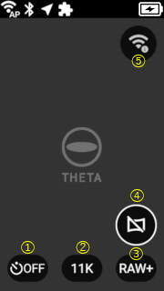
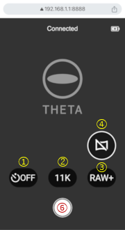
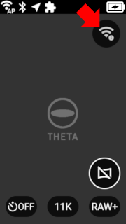
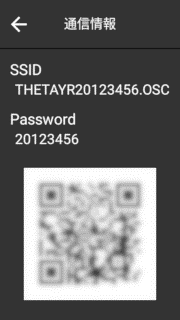
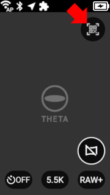
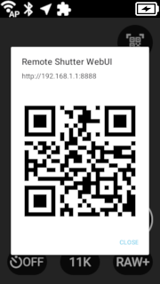

English(US) | [日本語](README.ja.md)

# HDR-DNG
Ricoh Company, Ltd.  
[Terms of Use](https://theta360.com/en/legal/terms_of_use_plugins/)

 

 <table>
  <tr>
   <td></td>
   <td></td>
   <td></td>
   <td></td>
  </tr>
 </table>

***

## Description

“HDR-DNG” is a plug-in for RICOH THETA X. It automatically processes four RAW images for HDR rendering in THETA X and outputs a rendered image in HDR-DNG format.  
  
This plug-in keeps the quality of shot 360-degree images stable and uniform, enables accurate expression of differences between light and dark colors, and reduces the time required for shooting and editing. It raises the potential of image editing, and enables shooting in 11K with high-definition image quality.  

## How to Install

HDR-DNG is pre-installed on THETA X firmware version 2.61.0 or later. For more information, visit the firmware download page:  
https://support.theta360.com/en/download/firmware/x/  

## How to Launch Plugin

Swipe left on the shooting screen of the THETA X to display the plugin selection screen, then tap “HDR-DNG”. For more details, please refer to [here](https://support.theta360.com/en/manual/x/content/menu-plugin.html).  

  

## How to Use Plugin

### Camera UI

  

> * Shutter button: Take picture.  
> * Mode button: Turn OFF/ON wireless LAN.  
> * ① Self-timer: OFF/5sec  
> * ② Image Resolution: 11K/5.5K (\*1)(\*2)  
> * ③ Image Format: RAW+JPEG/RAW  
> * ④ Preview: OFF/ON (\*3)  
> * ⑤ QR Code Display  

### WebUI

  

> * ⑥ Shutter button: Take picture.  

### Easy connection with QR code

You can easily connect to the wireless LAN and the WebUI with scanning QR code.

#### When the wireless LAN is NOT connected  

Tapping icon ⑤ will display a QR code for connecting to THETA X via wireless LAN. By scanning this QR code with your mobile phone camera, you can easily complete the wireless LAN connection.  

 
  

#### When the wireless LAN is connected  

Tapping icon ⑤ will display a QR code for connecting to the WebUI. By scanning this QR code with your mobile phone camera, you can easily complete the connection to the WebUI.  

 
  

“QR Code” is a registered trademark of DENSO WAVE INCORPORATED.

### Notes

- Bluetooth remote control can also take pictures. To use it, you need to pair it in advance before starting the plugin.  
- (\*1) The file size of HDR-DNG is approximately 115MB at 11K resolution and approximately 28.8MB at 5.5 resolution.  
- (\*2) The processing time to complete taking picture varies depending on the scene, but it takes about 10 seconds at 11K resolution and about 5 seconds at 5.5K resolution.  
- (\*3) Turning off the preview reduces power consumption, which can extend battery life, but it will add about 2 seconds to the picture completion time.  
- You can check the JPEG images taken with this plugin by closing the plugin and opening playback screen. However, HDR-DNG cannot be played back on the THETA X itself. You can check HDR-DNG images by connecting the THETA X camera to your laptop or PC via a USB cable and opening the folder to view them.  
  - Ref : [Displaying Thumbnails](https://support.theta360.com/en/manual/x/content/playback/playback_01.html)

### See Also

- [Procedure to use the latest plug-in for THETA X, “HDR-DNG”](http://blog.ricoh360.com/en/howtouse-thetax-hdrdng-plugin)

## Information

* Updated：2024/09/18
* Version：1.0.1
* Requires：
  * RICOH THETA X (Firmware version 2.61.0)
* Support：[THETA Support](https://support-theta.ricoh360.com/)
* Age Restriction：No

[def]: "assets/"
