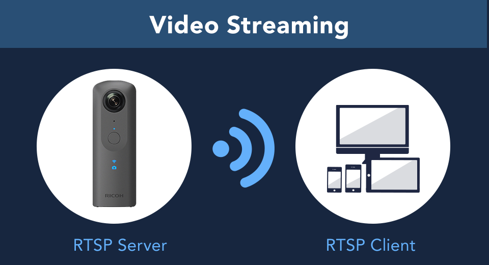

[English(US)](README.md) | 日本語

# THETA RTSP Streaming
Science Arts, Inc  
[プライバシーポリシー](../../README.ja.md#%E3%83%97%E3%83%A9%E3%82%A4%E3%83%90%E3%82%B7%E3%83%BC%E3%83%9D%E3%83%AA%E3%82%B7%E3%83%BC) | [利用規約](../../README.ja.md#%E5%88%A9%E7%94%A8%E8%A6%8F%E7%B4%84)

 
 <table>
  <tr>
   <td></td>
   <td></td>
   <td></td>
   <td></td>
  </tr>
 </table>

***

## 説明
This is a wireless live streaming plug-in by the RTSP server on THETA.  
You can open and play the RTSP Stream from RTSP client tool like vlc.  
  
Description  
  
1.Set RICOH THETA in Wireless LAN client mode.  
Video: https://www.youtube.com/watch?v=tkqyBNOWWIY&t=9s  
Manual:https://theta360.com/en/support/manual/v/content/prepare/prepare_08.html  
  
2.In the basic app for smartphone, select "Settings" > "Camera settings" and set "THETA RTSP Streaming" in "Plug-in", then tap the icon displayed next to "Starting plug-in".  
If the application is launched successfully, video LED on RICOH THETA turns on.  
  
3.Find out and remember the IP Address of RICOH THETA.  
i. Open the basic app for smartphone.  
ii. select "Setting" > "Camera setting" > "Camera version", then get IP Address.  
  
4.Receive live streaming from RTSP client application like vlc.  
vlc live streaming example  
  
i. Open the vlc.  
ii. select "Media" > "Open Network Stream", then set a network URL like below.  
rtsp://[your RICOH THETA IP Address]:8554/live?resolution=1920x960  
You can set a resolution of camera by the parameter which name of "resolution".  
You can set the "resolution" to "640x320", "1024x512", "1920x960" or "3840x1920". "3840x1920" may not work because of bandwidth.  
iii. If you want to change the resolution, push Stop Playback Button and retry (ii).    
  
  
## 新機能
update manifest to enable Z1

## 情報
  * 更新日：2020/12/11
  * バージョン：1.0.3
  * 要件：
    * RICOH THETA Z1 （ファームウェア バージョン 1.60.1）
    * RICOH THETA V （ファームウェア バージョン 3.00.1）
  * サポート：[Partner Plugins](https://community.theta360.guide/t/rtsp-streaming-plag-in/4556)
  * 年齢制限：なし

* プラグインをインストールするにはパソコン用基本アプリ [RICOH THETA](https://theta360.com/ja/about/application/pc.html#app-detail-01) が必要です
