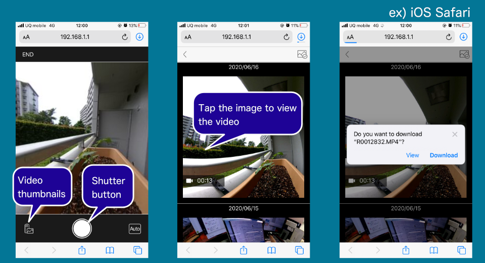
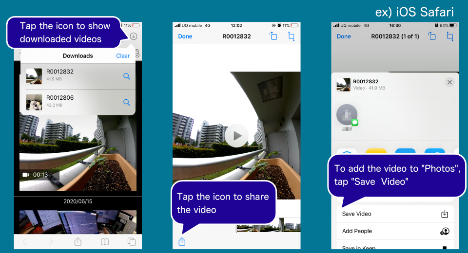
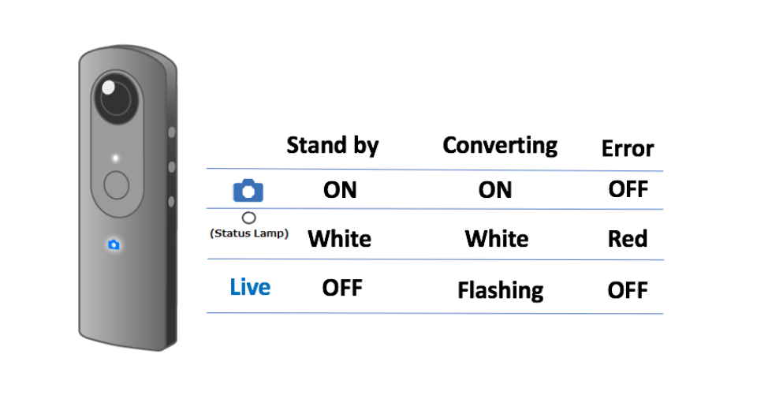

English(US) | [日本語](README.ja.md)

# Animation Auto Framing
Ricoh Company, Ltd.  
[Terms of Use](https://theta360.com/en/legal/terms_of_use_plugins/)

 

 <table>
  <tr>
   <td></td>
   <td></td>
   <td></td>
   <td></td>
  </tr>
 </table>

***

## Description
Ricoh’s original AI technology automatically recognizes the main subject in a captured 360-degree still image, and creates an animation* from it.  
These animations with a realistic feel can be shared even on social media that are not compatible with 360-degree images.  
  
*Saved as video format.  
  
YouTube  
https://youtu.be/9nJVk0Tjvjo  
  
How to Launch:  
1. Set "Animation Auto Framing" as an active plug-in from "Settings" - "Camera settings" - "Plug-in" in "RICOH THETA" basic app for the smartphone.
2. Press and hold the Mode button to activate the plug-in.
  
How to shoot: 
Tap the icon displayed next to "Start plug-in" in the basic app for smartphone. The browser is activated, and the settings screen appears.
Or just click the shutter button.  
After the shooting is done, animation is automatically generated.  
  
For more details such as how to download or the way to delete, see the image at the top.  

## Information
  * Updated：2020/6/24
  * Version：1.0.0
  * Requires：
    * RICOH THETA Z1 (Firmware version 1.50.1)
    * RICOH THETA V (Firmware version 3.40.1)
  * Support：[RICOH Plugins](https://support.theta360.com/ja/)
  * Age Restriction：No

* The [RICOH THETA](https://theta360.com/ja/about/application/pc.html#app-detail-01) basic app for computer is required to install plugins
