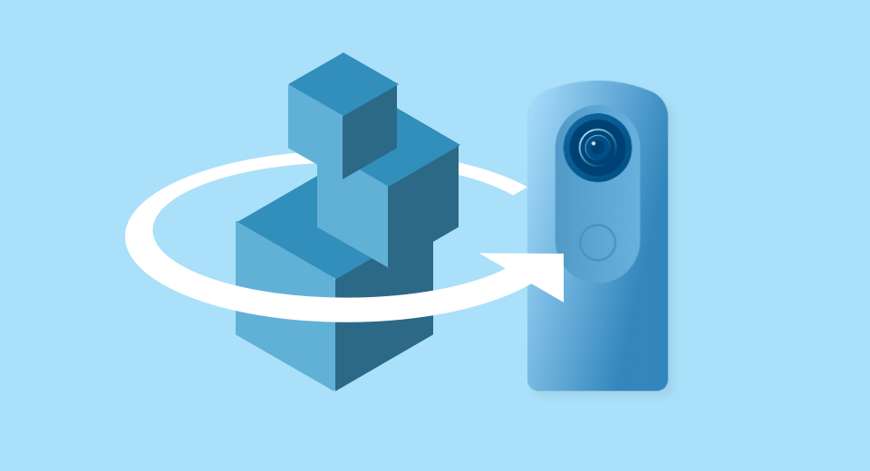
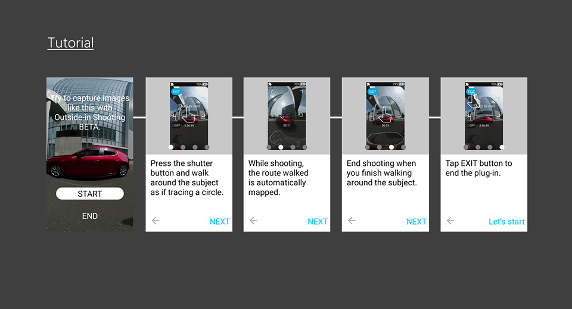
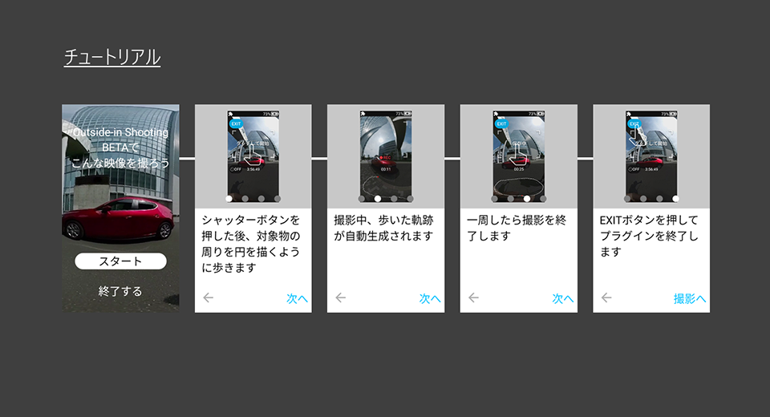

[English(US)](README.md) | 日本語

# Outside-in Shooting BETA

Ricoh Company, Ltd.  
[利用規約](https://www.ricoh360.com/ja/terms/plugins/)

<table><tr><td></td><td></td><td></td><td></td></tr></table>

## 説明

本プラグインは被写体の周りを一周しながら360°動画を撮影することで被写体を中心にいろいろな方向から見ることができる画像を生成します。。 Visual SLAM技術を用いて検出したカメラの位置情報*を360°動画に付与することで、従来の再生方法とは異なる360°の新しい映像体験を提供します。撮影した動画をカメラ本体で再生するとスワイプ操作に応じてコマ送りするようにして見ることができます。被写体を中心にしていろいろな方向から見られるので、物体の形状を把握するのに適しています。  

* GNSS（Global Navigation Satellite System）による位置情報ではなく、自己位置推定による相対的な位置情報  

※撮影環境や条件によっては映像が生成されない場合があります。詳細はこちら[Link:https://topics.theta360.com/ja/faq/c_08_x/8022/]  

[操作方法]  

-起動  
カメラの撮影画面で左方向にスワイプしてプラグイン選択画面を表示し、「Outside-in Shooting BETA」をタップします。  

-撮影設定  
・セルフタイマーボタンをタップすると、OFF、2秒、５秒、10秒から選択できます。  
・動画サイズは2K（1920x960）30fpsで固定されます。  

-撮影  
シャッターボタンを押すか、画面中央付近の枠をタップすると撮影が始まります。撮影が開始したら、撮影したい物体の周りを歩いて移動を始めてください。画像から位置を認識しますので、移動するときに周囲に特徴のあるものが写り続けるようにしてください。物体の周りを一周歩いたら、再びシャッターボタンを押すか、画面中央付近の枠をタップすると撮影が終わります。  

-再生  
撮影後に表示されるサムネイルをタップするか、プラグインを終了して再生画面のシングルビューでViewボタンをタップすると再生されます。シングルビューを左右にスワイプすると視点が移動します。  

## 新機能

  * 1.0.1 : バグ修正  

## 情報

- 更新日: 2024/09/30
- バージョン: 1.0.1
- 要件:
  - RICOH THETA X (v2.61.0)
- サポート: [RICOH Plugins](https://support.ricoh360.com/ja/)
- 年齢制限: なし
