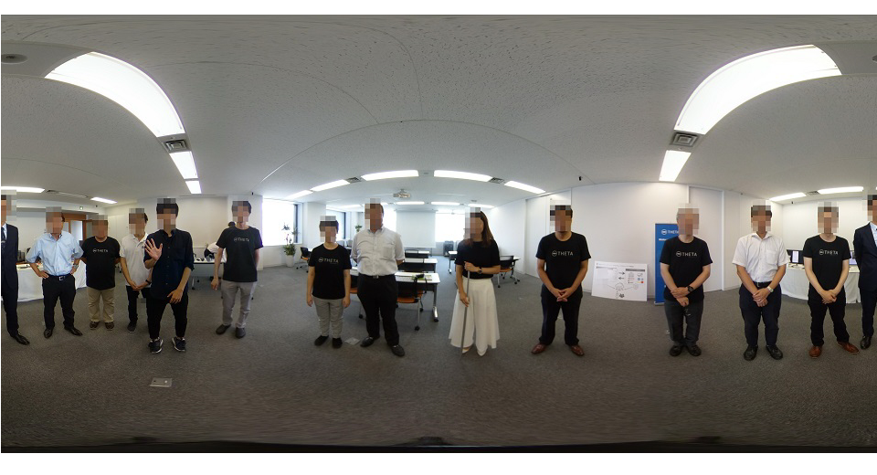
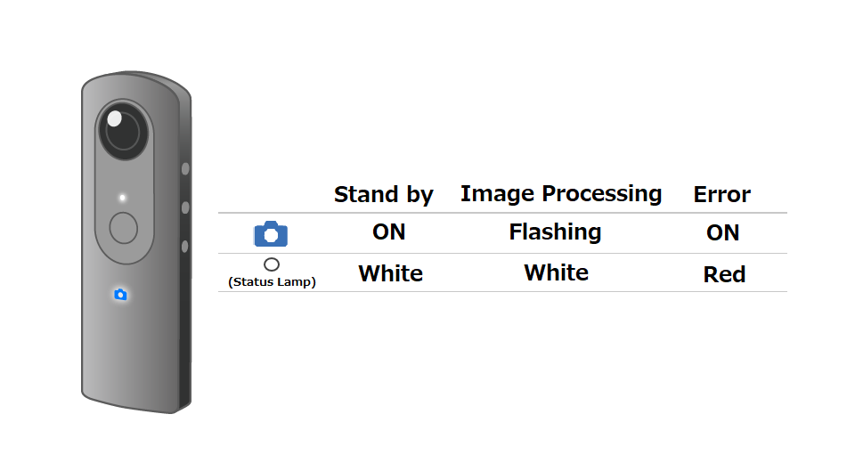

English(US) | [日本語](README.ja.md)

# Automatic Face Blur BETA
Ricoh Company, Ltd.  
[Terms of Use](https://theta360.com/en/legal/terms_of_use_plugins/)

 

 <table>
  <tr>
   <td></td>
   <td></td>
   <td></td>
   <td></td>
  </tr>
 </table>

***

## Description
Automatic Face Blur BETA automatically analyzes still images shot with RICOH THETA and blurs faces. Both the original and blurred photos are saved.

## What's New
RICOH THETA X is now supported.

## Information
  * Updated：2022/10/24
  * Version：1.7.0
  * Requires：
    * RICOH THETA X (Firmware version 1.30.0)
    * RICOH THETA Z1 (Firmware version 2.00.1)
    * RICOH THETA V (Firmware version 3.70.1)

  * Support：[RICOH Plugins](https://support.theta360.com/ja/)
  * Age Restriction：No

* The [RICOH THETA](https://theta360.com/ja/about/application/pc.html#app-detail-01) basic app for computer is required to install plugins
