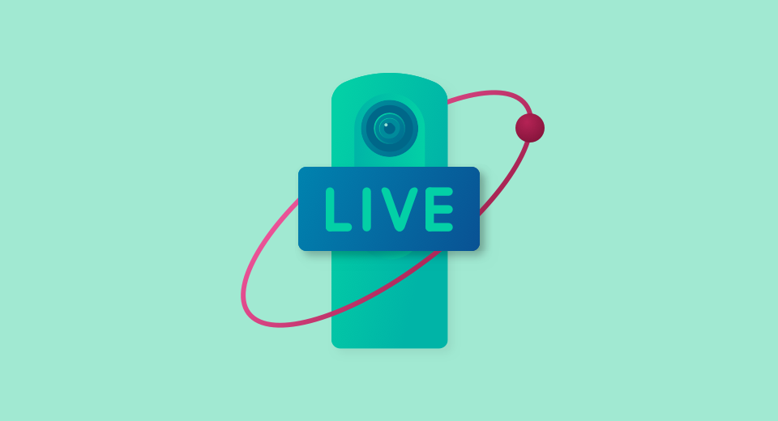
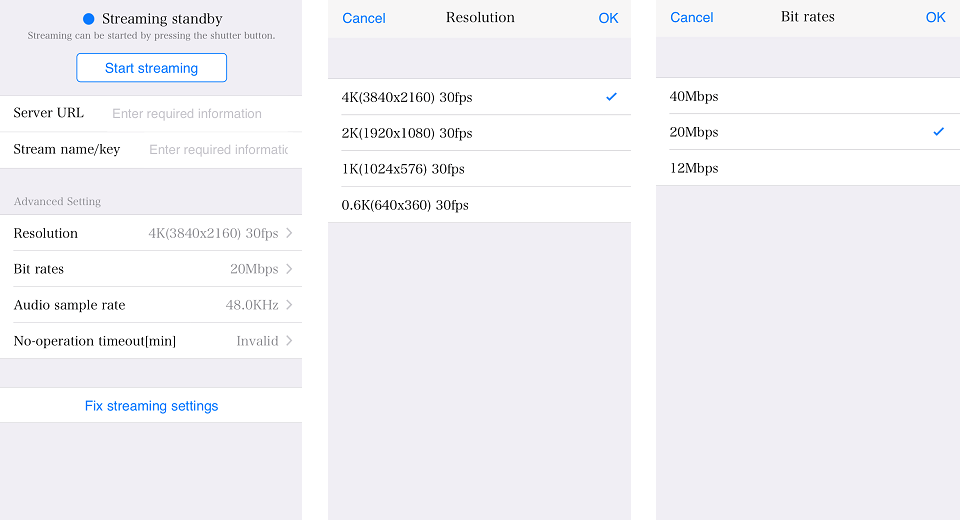
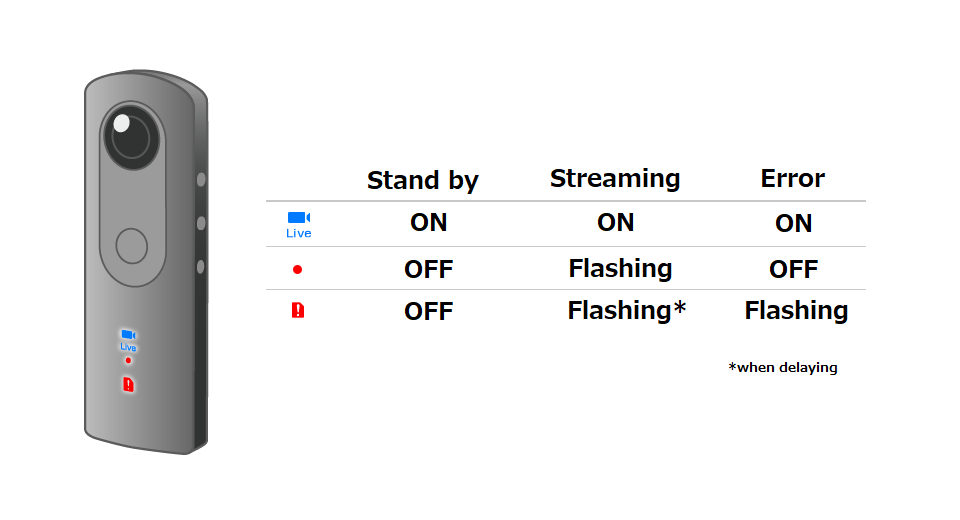
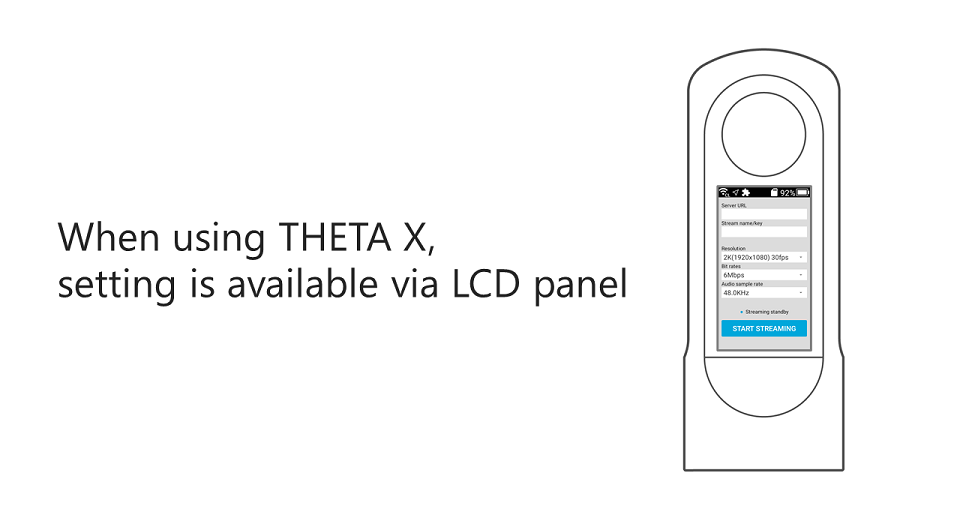

[English(US)](README.md) | 日本語

# Wireless Live Streaming
Ricoh Company, Ltd.  
[利用規約](https://theta360.com/en/legal/terms_of_use_plugins/)

 
 
 <table>
  <tr>
   <td></td>
   <td></td>
   <td></td>
   <td></td>
  </tr>
 </table>

***

## 説明
Wireless Live Streaming (無線ライブストリーミング）は、THETAを無線LANアクセスポイントに接続し、PCを介さずにYouTube経由で360°の映像を手軽にライブ配信できます。  
※THETAをクライアントモードで使用する必要があります。  

事前準備  
  
YouTubeライブストリーミングの設定は下記サイトをご覧ください。  
https://www.thetalab.ricoh/plugin/wireless-live-streaming/  
  
操作方法  
  
1. RICOH THETAをクライアントモードで接続  
設定方法は下記を参照。  
   * RICOH THETA X：https://support.theta360.com/ja/manual/x/content/prepare/prepare_11.html
   * RICOH THETA Z1：https://support.theta360.com/ja/manual/z1/content/prepare/prepare_08.html
   * RICOH THETA V：https://theta360.com/ja/support/manual/v/content/prepare/prepare_08.html
2. スマートフォン用基本アプリから「設定」-「カメラ設定」-「プラグイン」で「Wireless Live Streaming」を設定後、「プラグイン起動中」の横に表示されているアイコンをタップ。ブラウザが起動し、設定画面が表示される。
3. 事前準備で設定した「サーバー URL」と「ストリーム名/キー」を入力
4. 「動画サイズ」や「ビットレート」などを設定
5. 「設定内容を確定する」をタップ
6. シャッターボタンを押すか、「配信開始」をタップしてストリーミングを開始
7. ストリーミングを終了するにはシャッターボタンを押すか、「配信停止」をタップ

注意事項  
1. 通信環境によって設定画質で配信できない場合があります。
2. 長時間配信したときに、熱でシャットダウンする場合があります。

詳細はこちら：https://www.thetalab.ricoh/plugin/wireless-live-streaming/

## 新機能
* *THETA X v1.30.0以降との組み合せにて、天頂補正が動作しない問題への対処。
* THETA X v1.40.0以降との組み合せにて、動的繋ぎが正しく動作しない問題への対処。
* 特定のスレッドがCPUを占有していた問題への対処。

## 情報
  * 更新日：2023/05/09
  * バージョン：1.2.3
  * 要件：
    * RICOH THETA X （ファームウェア バージョン 2.00.0）
    * RICOH THETA Z1 （ファームウェア バージョン 2.30.1）
    * RICOH THETA V （ファームウェア バージョン 3.80.2）
  * サポート：[RICOH Plugins](https://support.theta360.com/ja/)
  * 年齢制限：なし

* プラグインをインストールするにはパソコン用基本アプリ [RICOH THETA](https://theta360.com/ja/about/application/pc.html#app-detail-01) が必要です
