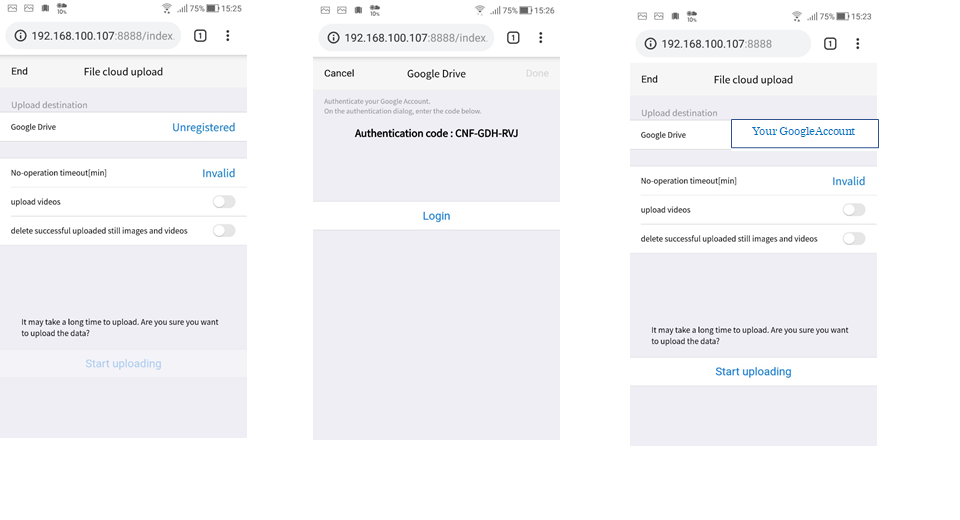
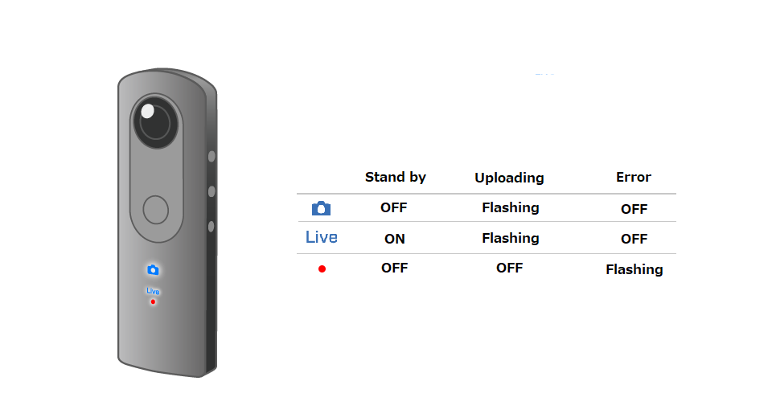

English(US) | [日本語](README.ja.md)

# File cloud upload V2
Ricoh Company, Ltd.  
[Privacy Policy](../../README.md#privacy-policy) | [Terms of Services](../../README.md#terms-of-services)

 

 <table>
  <tr>
   <td></td>
   <td></td>
   <td></td>
   <td></td>
  </tr>
 </table>

***

## Description
With File Cloud Upload V2, by connecting the RICOH THETA to a wireless LAN access point, you can directly upload image data on the camera to Google Drive .  
*RICOH THETA needs to be used in wireless LAN client mode.  
  
Preparations  
Make sure you have a Google Account.  
  
Instructions  
1.See the following for further details on how to connect RICOH THETA in wireless LAN client mode.  
  
Video: https://www.youtube.com/watch?v=tkqyBNOWWIY&t=9s  
Manual:https://theta360.com/en/support/manual/v/content/prepare/prepare_08.html  
  
2.In the basic app for smartphone, select "Settings" > "Camera settings" and set "File Cloud Upload V2" in "Plug-in", then tap the icon displayed next to "Starting plug-in". The browser is launched, and the settings screen appears.  
  
3.Tap "Start uploading".  
  
*For further configuration please see below.  
https://support.theta360.com/intl/ricoh_plugins/pdf/clouduploadv2_en.pdf  
  
Precautions  
If "Google Photos" is "Unregistered" in the settings screen, use the displayed authentication code to log in to Google Drive.  

## Information
  * Updated：2019/5/21
  * Version：1.0.0
  * Requires：
    * RICOH THETA Z1 (Firmware version 1.03.5)
    * RICOH THETA V (Firmware version 2.50.1)
  * Support：[RICOH Plugins](https://support.theta360.com/ja/)
  * Age Restriction：No

* The [RICOH THETA](https://theta360.com/ja/about/application/pc.html#app-detail-01) basic app for computer is required to install plugins
