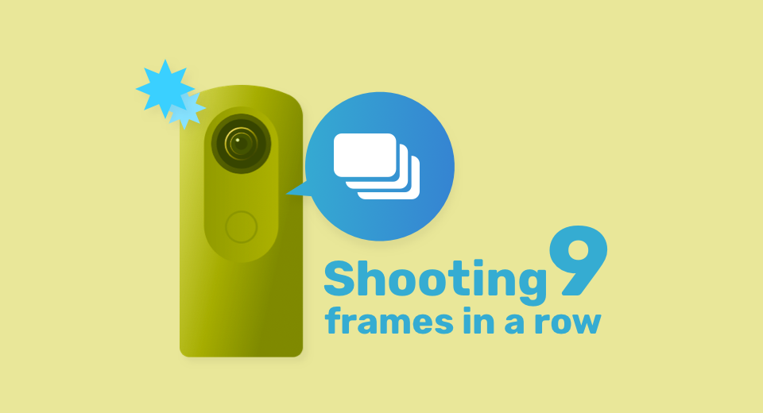

[English(US)](README.md) | 日本語

# Continuous Shooting
Ricoh Company, Ltd.  
[利用規約](https://theta360.com/en/legal/terms_of_use_plugins/)

 
 <table>
  <tr>
   <td></td>
   <td></td>
   <td></td>
   <td></td>
  </tr>
 </table>

***

## 説明
プラグインを起動し、シャッターを押すだけで、撮影条件はAUTOで９枚、連続撮影を行います。撮影条件によっては、最短0.3秒で撮影を終えることができます。当プラグインをTHETAの「使用するプラグイン」に設定しておけば、スマートフォンの基本アプリを介することなく、本体操作で連続撮影ができて便利です。  

※撮影後、数十秒程度の処理時間を要します。

## 情報
  * 更新日：2021/6/25
  * バージョン：1.0.0
  * 要件：
    * RICOH THETA Z1 （ファームウェア バージョン 2.00.1）
  * サポート：[RICOH Plugins](https://support.theta360.com/ja/)
  * 年齢制限：なし

* プラグインをインストールするにはパソコン用基本アプリ [RICOH THETA](https://theta360.com/ja/about/application/pc.html#app-detail-01) が必要です
