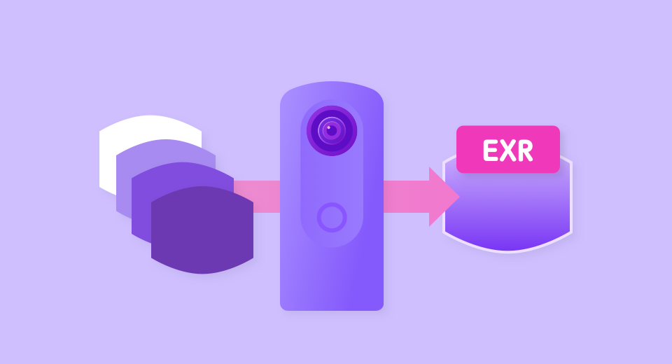

English(US) | [日本語](README.ja.md)

# HDRI-X
Ricoh Company, Ltd.  
[Terms of Use](https://theta360.com/en/legal/terms_of_use_plugins/)

 

 <table>
  <tr>
   <td></td>
   <td></td>
   <td></td>
   <td></td>
  </tr>
 </table>

***

## Description
This plug-in is for THETA X. The URL for the plug-in for THETA Z1 is below.  
https://github.com/ricohapi/theta-plugins/tree/main/plugins/com.theta360.hdri  
  

This plug-in will create high dynamic range images (EXR) in the camera after bracket shooting.  
"Normally, to create high dynamic range images (EXR), it was necessary to perform the lengthy process of shooting an image with the camera and then editing it on a PC before creating EXR data. The HDRI plug-in enables you to use only THETA to simply press the shutter button once to perform the process from shooting to image editing.  
Created high dynamic range images contain information with a wide range of brightness difference. This allows you to use them for ambient lighting when creating CG and rendering, which enables you to reproduce shades of light so that it feels as though you are actually in the space where the image was taken."  
You can also shoot while watching the live preview on the smartphone.  

[How to operate the plug-in]  

- Starting the plug-in  

1. Set "HDRI-X" as an active plug-in from "Settings" - "Camera settings"- "Plug-in” in "RICOH THETA" basic app for the smartphone.
2. Swipe left on the shooting screen of the camera to display the plug-in selection screen, and then tap "HDRI-X".

- Making shooting settings  
Five settings can be made from the menu displayed on the camera screen.  
  
  BRAKET : Sets the number of shots for bracket shooting. [7], [9], [11], [13] can be selected.  
EV STEP : Sets the EV step. [0.3], [0.7], [1.0], [1.3], [1.7], [2.0], [2.3], [2.7], [3.0] can be selected.  
ST : Sets the self-timer to save. [OFF], [2], [5], [10], [15] can be selected.  
SS<= : Sets the shutter speed upper limit. [0.5], [1.0], [2.0], [4.0], [8.0], [15.0], [30.0], [60.0] can be selected.  
FORMAT : Sets the HDR file format. [EXR], [HDR] can be selected.  
  
  *THETA X does not support RAW saving or burst capture.
  
  

- Live preview display on smartphone  
In the basic app for smartphone, select "Settings" - "Camera settings" - "Plug-in" - "HDRI", then tap the icon displayed next to "Starting plug-in".  
The browser is launched and the live preview is displayed.  

- Shooting  
Press the shutter button on the smartphone screen or the shutter button on the camera to start shooting.  
After “wait” is displayed, the set number of bracket shots are taken, and “merge” is displayed. When “merge” disappears, the data is saved.  
  
  *When using Remote Control TR-1, activate the remote control before using this plug-in  
*If the shutter upper limit (variable by setting) or lower limit (1/16000 seconds) is reached with the bracket, the set number of shots may not be reached.  

- Retrieving shooting data  
With the microSDXC card removed, connect the camera to a computer with a USB cable, and retrieve each data from the following folders.  
  
  *This plug-in does not support saving to microSDXC cards. Even if you take pictures with microSDXC inserted, all images will be saved in the internal memory. 
  
[.exr file]  
DCIM/HDRI/YYYYMMDD_HHMMSS.exr  
  
[.hdr file]  
DCIM/HDRI/YYYYMMDD_HHMMSS.hdr  
  
[Bracket shooting result (original data of .exr file)]  
DCIM/HDRI/Bracket/YYYYMMDD_HHMMSS/YYYYMMDD_HHMMSS_N.JPG  
  
## Information
  * Updated：2023/9/25
  * Version：1.0.0
  * Requires：
    * RICOH THETA X (Firmware version 2.20.1,2.21.0)
  * Support：[RICOH Plugins](https://support.theta360.com/en/)
  * Age Restriction：No

* The [RICOH THETA](https://theta360.com/ja/about/application/pc.html#app-detail-01) basic app for computer is required to install plugins
