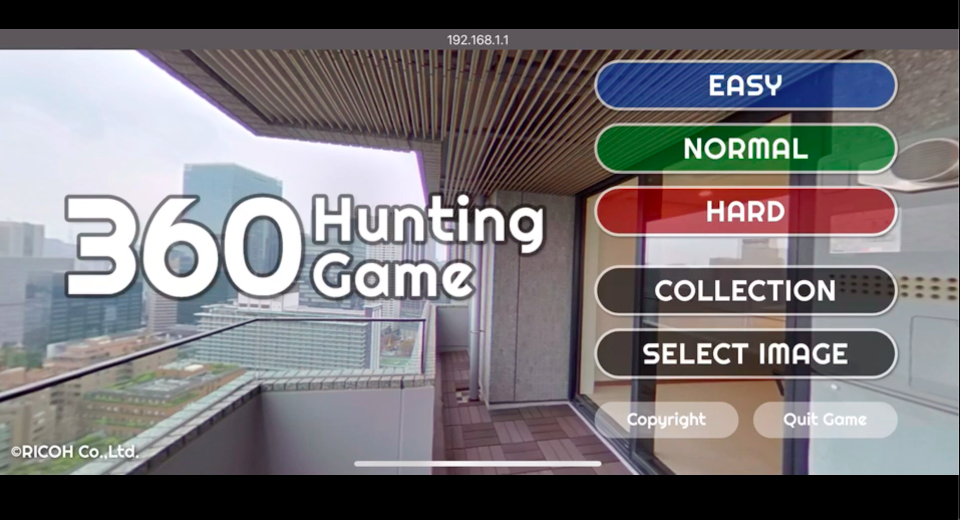
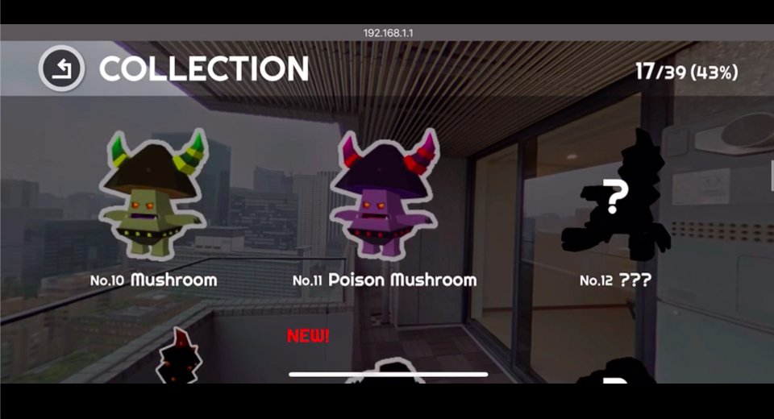
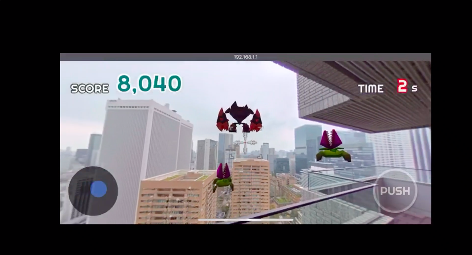
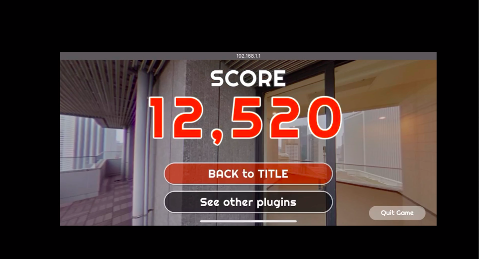

[English(US)](README.md) | 日本語

# 360 Hunting Game

Ricoh Company, Ltd.  
[利用規約](https://www.ricoh360.com/ja/terms/plugins/)

<table><tr><td></td><td></td><td></td><td></td></tr></table>

## 説明

360 Hunting Gameプラグインは、お手持ちのRICOH THETAの静止画を背景に、モンスターを捕まえることができるARゲームです。  
撮影した場所によって、出現するモンスターが変わったり、難易度がeasy/normal/hardの３種類があり、子供から大人まで楽しむことができるプラグインです。  
捕まえたモンスターは図鑑でコレクションされ、どんなモンスターを捕まえたかも見ることができます。  
  
起動方法  
スマートフォン用基本アプリから「設定」 -「カメラ設定」-「プラグイン」で「360 Hunting Game」を選択後、「プラグイン起動中」の横に表示されているアイコンをタップ。  
  
注意事項  
プラグインを起動した状態で、スマートフォン用基本アプリを操作することは出来ません。  
ゲームプレイ中にカメラがスリープ状態に入ってしまう場合があり、ゲームが中断される可能性があります。カメラのスリープを変更する場合は、RICOH THETAアプリの「設定」からスリープ時間の変更をお願いします。  

## 情報

- 更新日: 2020/5/27
- バージョン: 1.0.0
- 要件:
  - RICOH THETA Z1 (v1.20.1, v1.40.1)
  - RICOH THETA V (v3.21.1, v3.30.1)
- サポート: [RICOH Plugins](https://support.ricoh360.com/ja/)
- 年齢制限: なし
