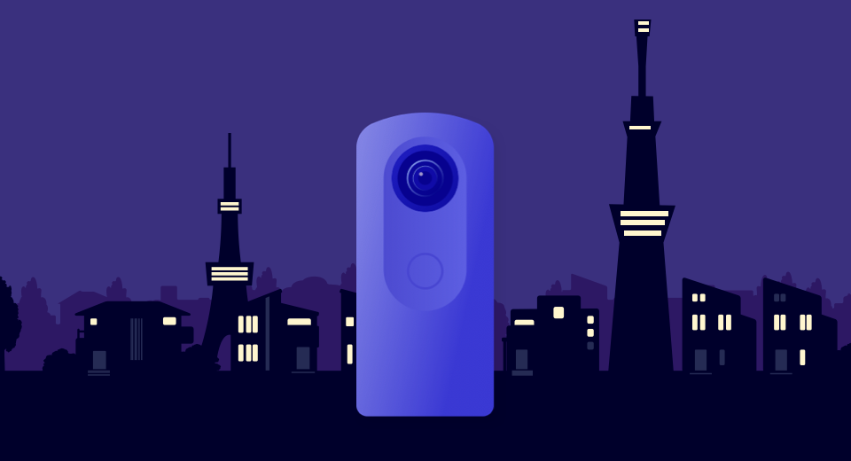
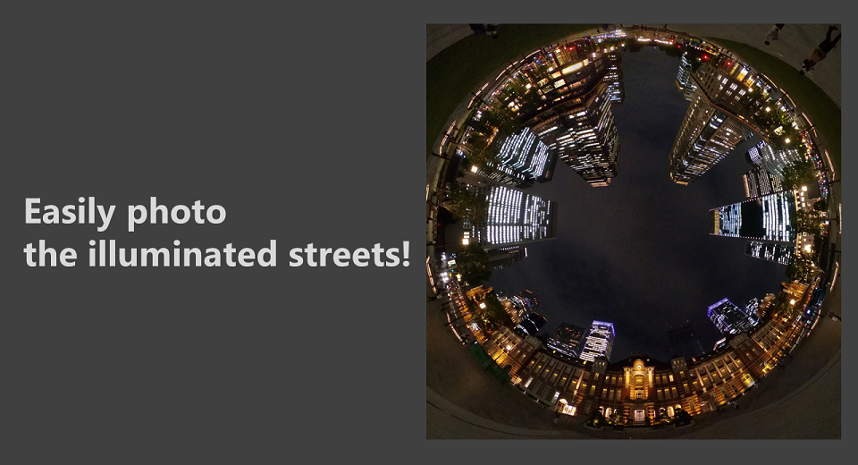
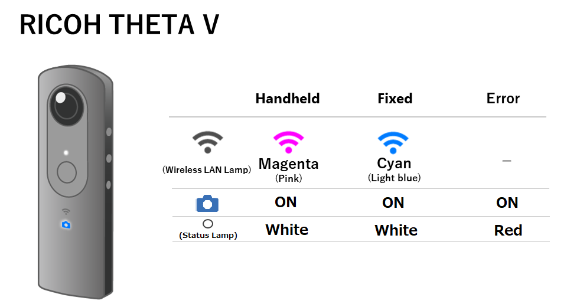

[English(US)](README.md) | 日本語

# Instant Night Snap
Ricoh Company, Ltd.  
[利用規約](https://theta360.com/en/legal/terms_of_use_plugins/)

 
 <table>
  <tr>
   <td></td>
   <td></td>
   <td></td>
   <td></td>
  </tr>
 </table>

***

## 説明
本プラグインはきらびやかな夜景を手軽に撮影いたします。  
  
RICOH THETAの撮影モードAUTOで夜景を撮影すると、見たままの印象の写真にならないことがあります。  
夜景など明るさが足りない場面をきれいに撮影するためには、光の状態に応じて撮影条件の設定値の変更が必要でした。  
Instant Night Snap Plug-inは、夜景に適した撮影設定に変更してくれるので、きらびやかな夜景を手軽に撮影できます。  

Instant Night Snapプラグインでは、手持ちで撮影しているのかどうか、自動判別を行い、使用する撮影設定を変更いたします。固定撮影と判別した場合、シャッターボタンを押した5秒後に撮影します。  

RICOH THETA Z1のみ、リモートコントロールTR-1を使用して撮影できます。その際は手持ち・固定にかかわらず、TR-1でシャッターを押したときに、シャッターが切れます。本プラグインを起動する前にリモートコントロールを有効にしてお使いください。  

* 手持ち撮影時：シャッター速度優先で撮影
  * THETA Z1: 表示パネルにHANDHELD POSITIONと表示  
  * THETA V: 無線ランプがマゼンタに光ります  

* 固定撮影：ISO感度優先で撮影
  * THETA Z1: 表示パネルにFIXED POSITIONと表示  
  * THETA V: 無線ランプがシアンに光ります  
  

* 固定撮影を行う際にはしっかりとした三脚を使用するか、安定した場所に直接カメラを立ててください。  
 自立できる一脚のような機材の場合、動きの支点からカメラまでの距離が長いため、  
 ボタン操作による揺れが大きめとなり、固定撮影できない可能性があります。  

* 保存される画像のファイル形式はJPEGのみとなります。

[操作方法]  

- 起動  

スマートフォン用基本アプリから「設定」-「カメラ設定」-「プラグイン」で「Instant Night Snap」を選択する。  

その後、「プラグインを起動」をタップ、または、THETA本体のModeボタン長押しする。  

- 撮影  

シャッターボタンを押す。  
RICOH THETA Z1は、リモートコントロール(TR-1)にも対応しています。  

* RICOH THETA Vは、本プラグインとリモートコントロールの併用が行えません。  

## 情報
  * 更新日：2021/10/10
  * バージョン：1.0.0
  * 要件：
    * RICOH THETA Z1 （ファームウェア バージョン 2.00.1）
    * RICOH THETA V （ファームウェア バージョン 3.70.1）
  * サポート：[RICOH Plugins](https://support.theta360.com/ja/)
  * 年齢制限：なし

* プラグインをインストールするにはパソコン用基本アプリ [RICOH THETA](https://theta360.com/ja/about/application/pc.html#app-detail-01) が必要です
