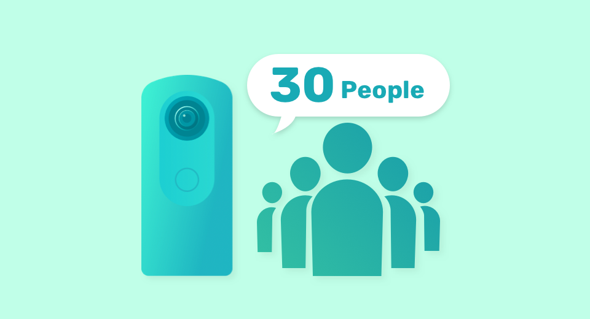
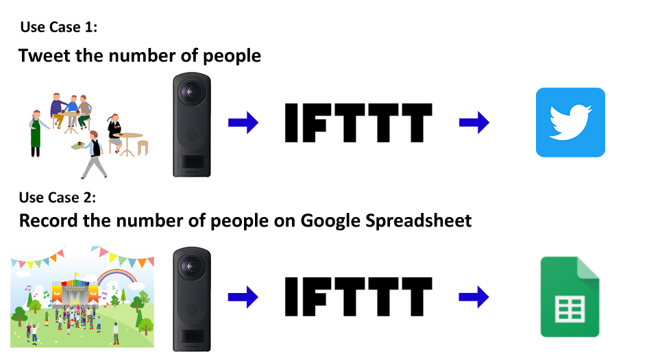

English(US) | [日本語](README.ja.md)

# Person Detection & Counting

Ricoh Company, Ltd.  
[Terms of Use](https://www.ricoh360.com/terms/plugins/)

<table><tr><td></td><td></td><td></td><td></td></tr></table>

## Description

People captured by THETA are detected and the count is posted to IFTTT*. Posting of the count of people detected at the set time interval is repeated.  
  
*IFTTT is a web service that links different services such as Twitter, Facebook, and Google Drive.  
  
Usage Example 1:  
Posting the number of people detected in a store to social media such as Twitter  
  
Usage Example 2:  
Taking a people count at an event and entering it into a Google spreadsheet  
  
See the following manual for setting details.  
https://support.theta360.com/intl/ricoh_plugins/pdf/persondetectionandcounting_en.pdf  

## Information

- Updated: 2020/10/12
- Version: 1.0.0
- Requires:
  - RICOH THETA Z1 (v1.60.1)
  - RICOH THETA V (v3.50.1)
- Support: [RICOH Plugins](https://support.ricoh360.com/)
- Age Restriction: No
