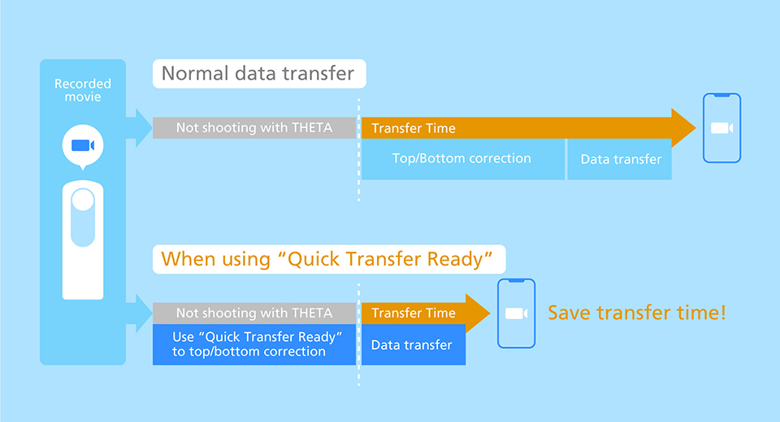

English(US) | [日本語](README.ja.md)

# Quick Transfer Ready

Ricoh Company, Ltd.  
[Terms of Use](https://www.ricoh360.com/terms/plugins/)

<table><tr><td></td><td></td><td></td><td></td></tr></table>

## Description

This plug-in applies top/bottom correction to the recorded videos. When the image is saved as dual fish, this plug-in applies top/bottom correction and stitching process. As the video is converted inside THETA, shooting is not available while this plug-in is in use. By using this plug-in before transferring video files to a smartphone, it can reduce the data transfer time.  

*Please note that the video converted with this plug-in will overwrite the original data.  

*All video files with a recording time of 5 minutes or less are will be converted. If you have many video files, please note that it will take time to finish converting all the files.  

*If the conversion takes time, you can shut down the process. The original video file that was being converted will be safely retained.  

*The conversion process starts from the video file with the latest date.  

## Information

- Updated: 2021/4/19
- Version: 1.0.0
- Requires:  
RICOH THETA Z1 (v1.60.1, v1.80.1)  
RICOH THETA V (v3.50.1, v3.60.1)
- Support: [RICOH Plugins](https://support.ricoh360.com/)
- Age Restriction: No
