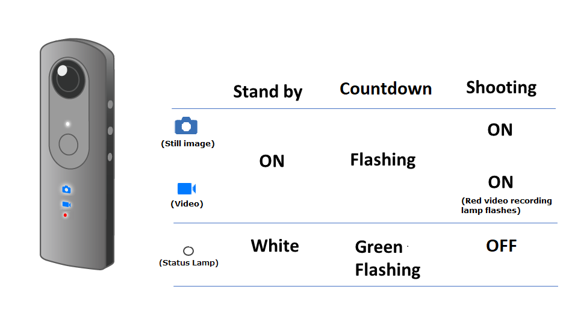

[English(US)](README.md) | 日本語

# Self-timer Locked
Ricoh Company, Ltd.  
[利用規約](https://theta360.com/en/legal/terms_of_use_plugins/)

 
 <table>
  <tr>
   <td></td>
   <td></td>
   <td></td>
   <td></td>
  </tr>
 </table>

***

## 説明
Self-timer Locked（セルフタイマー固定）プラグインを使うことで、静止画・動画をセルフタイマーモードで撮影できます。  
RICOH THETA Vで水中ハウジングケース(TW-1)を利用する場合も、セルフタイマー撮影を行うことができます。  
撮影設定は、プラグインを起動する前の状態が維持されます。  
  
<操作方法（RICOH THETA V）>  
スマートフォン用基本アプリから「設定」－「カメラ設定」-「プラグイン」で「Self-timer locked」を設定します。  
Modeボタンを長押しし、プラグインを起動します。  
本体シャッターボタンを押してセルフタイマーを開始します。  
カウントダウンが始まり、設定時間後に撮影されます。  
カウントダウン中は、撮影モードランプが緑で点滅し、カウントダウン音が鳴ります。  
（残り2秒未満になると点滅が速くなります。点滅が速くなると、カウントダウン音の間隔も短くなります。）  
  
＜注意事項＞  
プラグインを起動した状態で、スマートフォン用基本アプリを操作することは出来ません。  
スマートフォンからのリモートシャッターや設定変更、画像転送はできません。  

## 新機能
RICOH THETA Z1に対応しました。

## 情報
  * 更新日：2019/5/8
  * バージョン：1.1.0
  * 要件：
    * RICOH THETA Z1 （ファームウェア バージョン 1.03.5）
    * RICOH THETA V （ファームウェア バージョン 2.50.1）
  * サポート：[RICOH Plugins](https://support.theta360.com/ja/)
  * 年齢制限：なし

* プラグインをインストールするにはパソコン用基本アプリ [RICOH THETA](https://theta360.com/ja/about/application/pc.html#app-detail-01) が必要です
