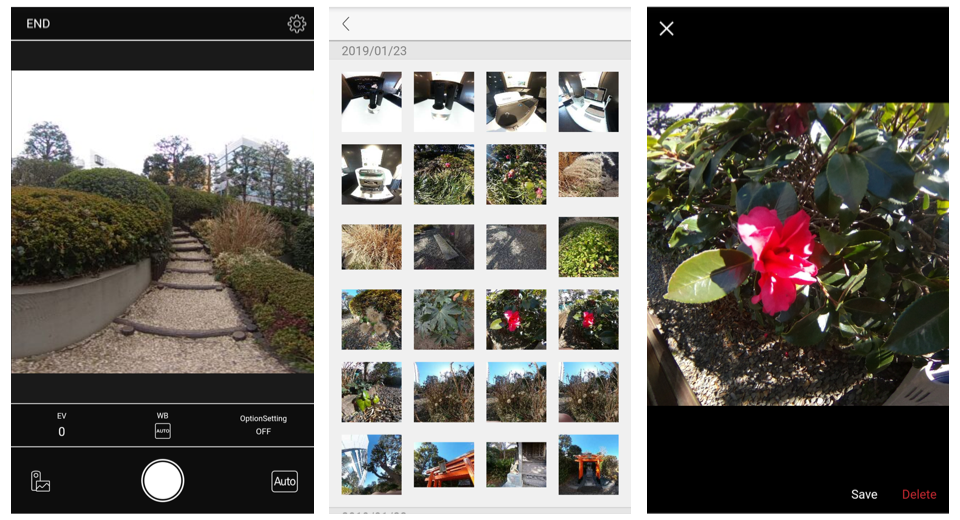
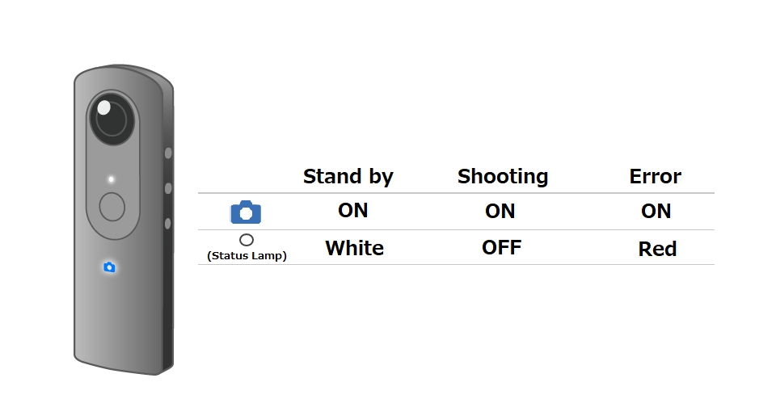

[English(US)](README.md) | 日本語

# Single Lens Shooting
Ricoh Company, Ltd.  
[利用規約](https://theta360.com/en/legal/terms_of_use_plugins/)

 
 <table>
  <tr>
   <td></td>
   <td></td>
   <td></td>
   <td></td>
  </tr>
 </table>

***

## 説明
Single Lens Shooting（シングルレンズ撮影）は、THETAのフロントレンズ（シャッターボタンの反対側）だけで静止画を撮影できます。  
アスペクト比は、4:3、1:1の2種類があります。  
  
4:3（対角85度） 35㎜フィルム用レンズ換算の焦点距離は23.6mm相当  
1:1（対角180度） 35㎜フィルム用レンズ換算の焦点距離は10.8㎜相当  
  
操作方法  
  
撮影  
  
スマートフォン用基本アプリから「設定」－「カメラ設定」-「プラグイン」で「Single Lens Shooting」を設定。  
Modeボタンを長押しし、プラグインを起動する。  
本体シャッターボタンを押して撮影する。  
（プラグインの起動、撮影はスマートフォンからでも操作可能）  
  
設定変更  
  
スマートフォン用基本アプリから「設定」 -「カメラ設定」-「プラグイン」で「Single Lens Shooting」を選択後、「プラグイン起動中」の横に表示されているアイコンをタップ。  
ブラウザが起動し、設定画面が表示される。  
項目を選択して設定を変更する。  
  
注意事項  
  
プラグインを起動した状態で、スマートフォン用基本アプリを操作することは出来ません。  

## 新機能
画質を改善しました。

## 情報
  * 更新日：2019/7/1
  * バージョン：1.0.1
  * 要件：
    * RICOH THETA Z1 （ファームウェア バージョン 1.03.5）
    * RICOH THETA V （ファームウェア バージョン 3.00.1）
  * サポート：[RICOH Plugins](https://support.theta360.com/ja/)
  * 年齢制限：なし

* プラグインをインストールするにはパソコン用基本アプリ [RICOH THETA](https://theta360.com/ja/about/application/pc.html#app-detail-01) が必要です
