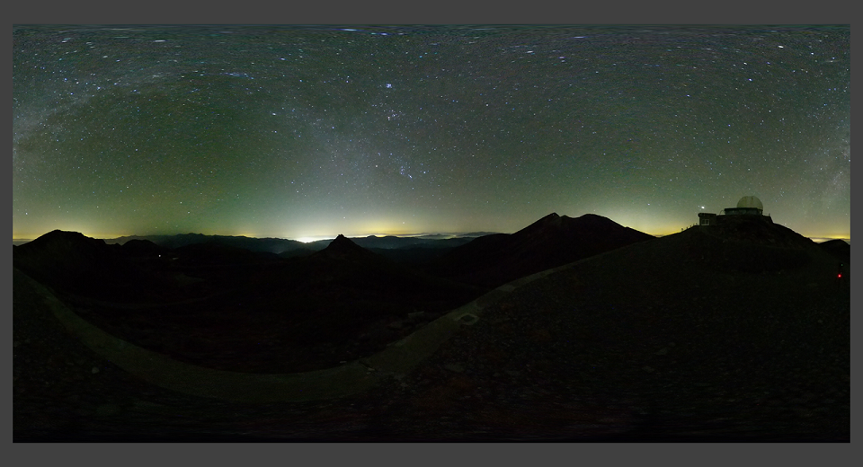
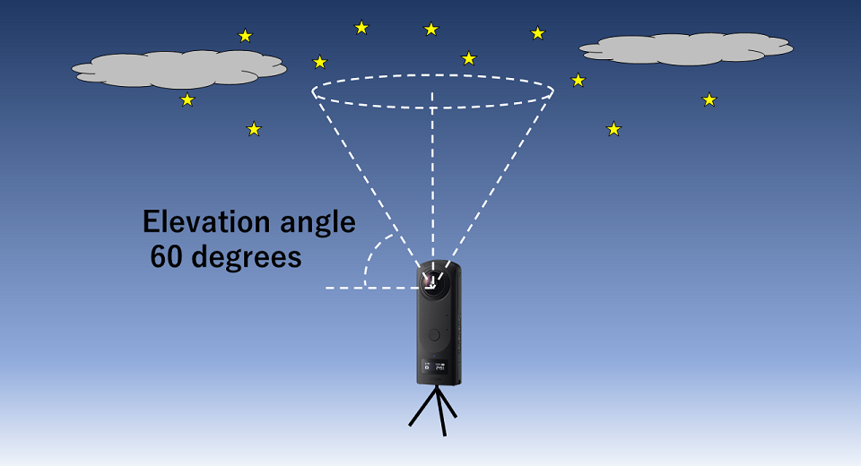
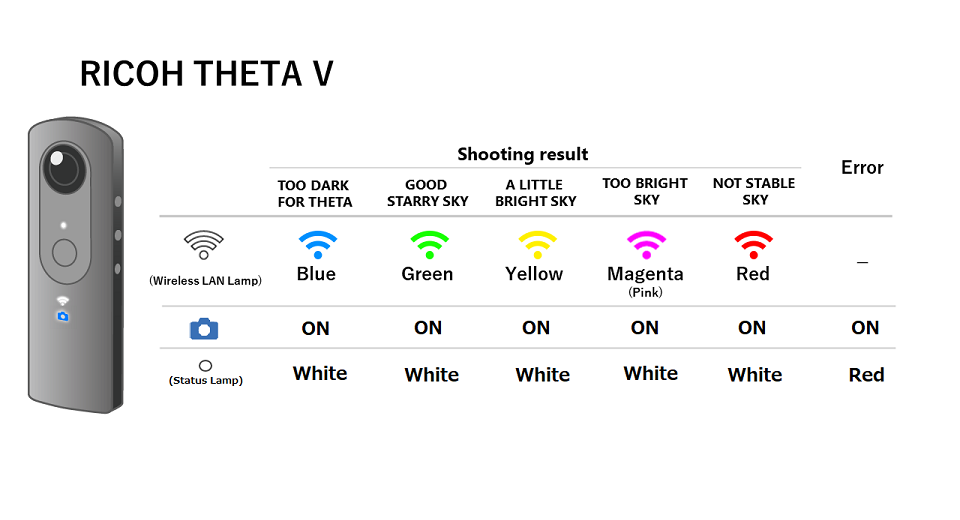

[English(US)](README.md) | 日本語

# Starry Sky Snap
Ricoh Company, Ltd.  
[プライバシーポリシー](../../README.ja.md#%E3%83%97%E3%83%A9%E3%82%A4%E3%83%90%E3%82%B7%E3%83%BC%E3%83%9D%E3%83%AA%E3%82%B7%E3%83%BC) | [利用規約](../../README.ja.md#%E5%88%A9%E7%94%A8%E8%A6%8F%E7%B4%84)

 
 
 <table>
  <tr>
   <td></td>
   <td></td>
   <td></td>
   <td></td>
  </tr>
 </table>

***

## 説明
本プラグインは、簡単に星空を撮影 できるプラグインです。  

星空を撮影するには、色々な撮影設定が必要です。このプラグインでは、星空が見える環境で、シャッターボタンを押すだけで、カメラが星空の状態を分析し、最適な撮影設定で撮影を行います。専門的な知識がなくても簡単に星空が撮影できます。  

[操作方法]  

- 起動  
スマートフォン用基本アプリから「設定」－「カメラ設定」-「プラグイン」で「Starry Sky Snap」を選択。
Modeボタンを長押しし、プラグインを起動する。  
本体シャッターボタンを押して撮影する。  

- 設定  
THETA Z1の場合、WLANボタンを押し、ファイル保存形式を「JPEG」または「RAW+」のいずれかを選択する。  

- 撮影  
シャッターボタンを押す。  
本撮影まで最大2回の試写を行い、設定値を分析（長秒時の撮影音でお知らせ）  
セルフタイマー音で、分析完了をお知らせ  
通常の長秒時の撮影音で本撮影  

試写の最中、仰角60°より高い領域が強い光で一時的に照らされた場合、下記アラートが表示されます。下記アラートが表示された場合、原因となった光の影響を受けない場所に移動するなどして、再度撮影を行ってください。  
  
THETA Z1：[ NOT STABLE SKY] と表示  
THETA V: 無線ランプの色が赤色に表示  
  
* RICOH THETA Z1はリモートコントロール(TR-1)に対応しています。RICOH THETA Vは対応していません。
* 本プラグインは、試写の結果を削除することから、本撮影のファイル名が連番となりません。

撮影が完了すると、夜空の状態を表示します。  
RICOH THETA Z1は文字列、RICOH THETA Vは無線ランプの色でお知らせ。  

[TOO DARK FOR THETA] （青）  
[GOOD STARRY SKY] （緑）  
[ A LITTLE BRIGHT SKY] （黄）  
[ TOO BRIGHT SKY] （マゼンタ）  

RICOH THETA Z1は、撮影完了後、Fnボタンを押すと、撮影設定を見ることが可能です。  
同じ地点で、星空撮影を他のカメラで行うときの設定値の参考として使用できます。  

[注意点]  

本プラグインは、スマートフォン基本アプリから撮影できません。  

本プラグインは、夜空の暗さによって、最長60秒の露光を行うことがあります。必ず、カメラを三脚などに固定してから撮影してください。  

本プラグインは、カメラの傾きに関係なく、仰角60°より高い領域からの撮影設定を決定いたします。この領域に木の枝などの障害物や不要な光が入らないような場所で撮影を行ってください。  

本体のシャッターボタンを押したときに、カメラが固定されていないことを検知した場合、警告音の後、通常撮影が行われます。RICOH THETA Z1は、プラグイン名の右側 本体の表示パネルにも警告アイコン [!] が表示されます。  

THETA Z1で設定したファイル保存形式は、プラグイン独自に保持しており、プラグインを終了しても次回起動時に引き継がれます。  

本プラグインを正しく終了しなかった場合、プラグイン起動前のカメラ設定が変更されている場合があります。  

## 新機能
RICOH THETA Z1において、無線ボタン操作によりファイル保存形式(JPEG/RAW+)を選択できるようにしました。 

## 情報
  * 更新日：2022/9/16
  * バージョン：1.1.0
  * 要件：
    * RICOH THETA Z1 （ファームウェア バージョン 2.10.1）
    * RICOH THETA V （ファームウェア バージョン 3.80.2）
  * サポート：[RICOH Plugins](https://support.theta360.com/ja/)
  * 年齢制限：なし

* プラグインをインストールするにはパソコン用基本アプリ [RICOH THETA](https://theta360.com/ja/about/application/pc.html#app-detail-01) が必要です
