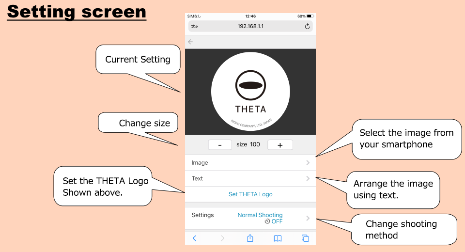
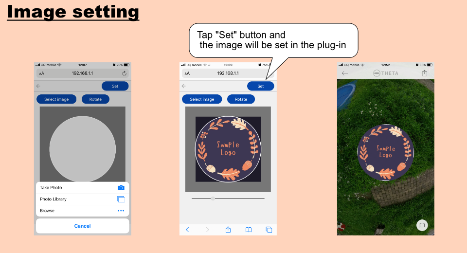
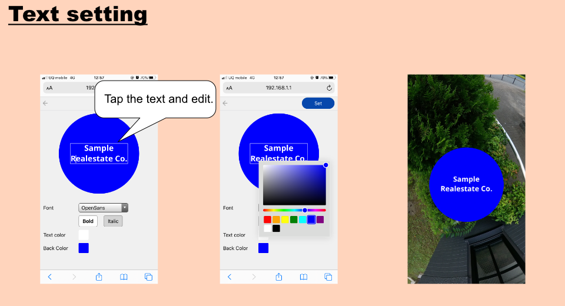
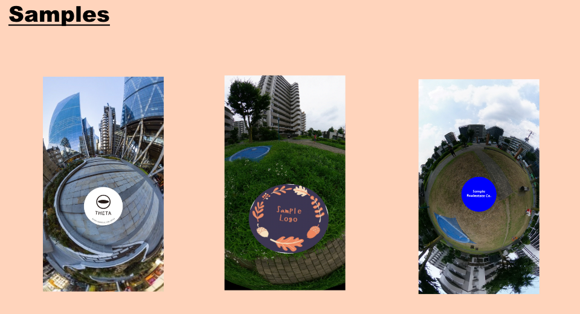

English(US) | [日本語](README.ja.md)

# Underside Cover

Ricoh Company, Ltd.  
[Terms of Use](https://www.ricoh360.com/terms/plugins/)

<table><tr><td></td><td></td><td></td><td></td></tr></table>

## Description

An image can be automatically inserted into the bottom of a 360-degree image during shooting to hide scenery below the camera, such as a tripod or hand. You can select from the following images to insert.  
- Image (image saved on a smartphone)
- Text
- THETA Logo (default setting)

The selected image is inserted during shooting even when the camera is not connected to a smartphone.  

* Use the basic app for smartphone to transfer and save the image.
* Shooting settings cannot be changed with the plug-in. Make shooting settings using the basic app for smartphone before running the plug-in.

[Operations]  
  
How to Launch:  

1. Set "Animation Auto Framing" as an active plug-in from "Settings" - "Camera settings" - "Plug-in" in "RICOH THETA" basic app for the smartphone.
2. Press and hold the Mode button to activate the plug-in.

How to shoot:  
  
Tap the icon displayed next to "Start plug-in" in the basic app for smartphone. The browser is activated, and the settings screen appears.
Or just click the shutter button.  
After the shooting is done, animation is automatically generated.  

## What's New
The content of this update is as follows.  

1. Addition of shooting method:  
"Self-timer" and "Time Shift" have been added to shooting methods.  
These can be selected on the settings screen.  
- Self-timer:
- You can perform shooting using the self-timer. The countdown time (seconds) can be set in "Shooting settings" on the settings screen.
- Time Shift:
- You can perform shooting in the same way as with the existing plug-in "TimeShiftShooting".
* See RICOH Plug-in STORE for details on "TimeShiftShooting".

2. Addition of image preview:  
When the shutter button is pressed on the plug-in screen, an image preview is displayed after shooting.  
* The preview function can be turned on and off.
* When the shutter button on the THETA is pressed for shooting, an image preview is not displayed.

3. Change of inserted image size:  
You can now change the area covered by an inserted image. This can be changed on the settings screen.  

## Information

- Updated: 2021/1/18
- Version: 1.1.0
- Requires:
  - RICOH THETA Z1 (v1.60.1)
  - RICOH THETA V (v3.50.1)
- Support: [RICOH Plugins](https://support.ricoh360.com/)
- Age Restriction: No
