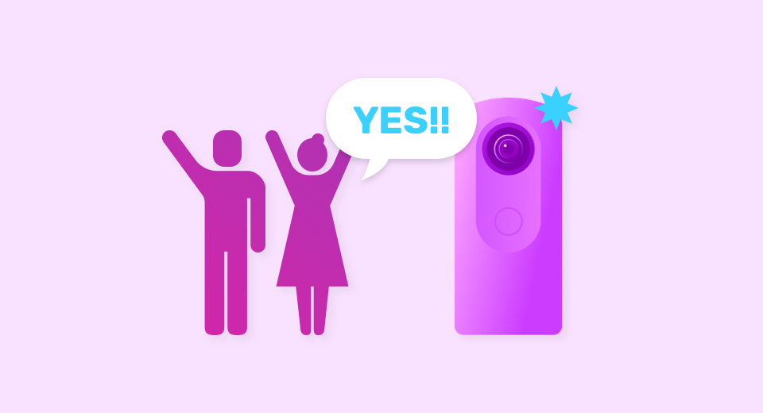

[English(US)](README.md) | 日本語

# Voice Trigger Capture
Ricoh Company, Ltd.  
[プライバシーポリシー](../../README.ja.md#%E3%83%97%E3%83%A9%E3%82%A4%E3%83%90%E3%82%B7%E3%83%BC%E3%83%9D%E3%83%AA%E3%82%B7%E3%83%BC) | [利用規約](../../README.ja.md#%E5%88%A9%E7%94%A8%E8%A6%8F%E7%B4%84)

 
 <table>
  <tr>
   <td></td>
   <td></td>
   <td></td>
   <td></td>
  </tr>
 </table>

***

## 説明
音声で静止画撮影ができます。   
プラグインを起動させ「YES」と声をかけると、シャッターボタンを押さなくても撮影することができます。   

※静止画のみ対応しています。動画モードの状態で起動した場合でも、静止画モードとして立ち上がります。   
※起動時の静止画撮影設定が引き継がれます。   
※本プラグインを起動している時は、音声のみで撮影できます。   
※音声の届く距離は2～3mを想定していますが、騒がしい場所での使用など、周囲の状況によっては反応しにくくなる場合があります。   

[操作方法]   

- 起動  

スマートフォン用基本アプリから「設定」-「カメラ設定」-「プラグイン」で「Voice Trigger Capture」を選択。「プラグインを起動」ボタンを押す。   
または   
スマートフォン用基本アプリでプラグインを「Voice Trigger Capture」を選択した後、THETA本体のModeボタン長押しする。   

- 撮影  

「YES」と声をかける  

## 新機能
- RICOH THETA Xに対応しました。

## 情報
  * 更新日：2022/5/16
  * バージョン：1.1.0
  * 要件：
    * RICOH THETA X （ファームウェア バージョン 1.00.2）
    * RICOH THETA Z1 （ファームウェア バージョン 2.00.1）
    * RICOH THETA V （ファームウェア バージョン 3.70.1）
  * サポート：[RICOH Plugins](https://support.theta360.com/ja/)
  * 年齢制限：なし

* プラグインをインストールするにはパソコン用基本アプリ [RICOH THETA](https://theta360.com/ja/about/application/pc.html#app-detail-01) が必要です
