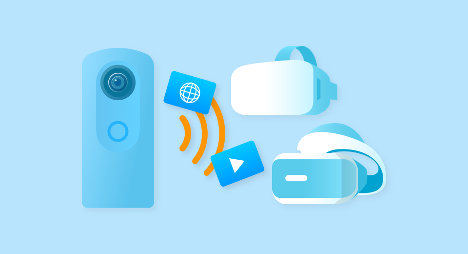

English(US) | [日本語](README.ja.md)

# VR Media Connection
Ricoh Company, Ltd.  
[Privacy Policy](../../README.md#privacy-policy) | [Terms of Services](../../README.md#terms-of-services)

 

 <table>
  <tr>
   <td></td>
   <td></td>
   <td></td>
   <td></td>
  </tr>
 </table>

***

## Description
“VR Media Connection” plug-in enables to connect the head mounted display (HMD) and the RICOH THETA wirelessly, and to enjoy the data stored in the THETA in a 360-degree view. In addition to HMD, any devices with DLNA's Media Player function enables to view the data in THETA images wirelessly.  
  
Manual: https://support.theta360.com/intl/ricoh_plugins/pdf/vrmediaconnection_en.pdf  
  
Connection Mode:  
"VR Media Connection" can be used in two connection modes, "AP mode" and "CL mode".  
※ Depending on the HMD / DLNA compatible device, it may not be possible to use in "AP mode".  
  
Tested Equipment:  
Equipment which has been tested to work in the plug-in.  
At the moment, testing of following HMD and DLNA compatible devices has been done.  
However it does not guarantee the operation.  
  
* Oculus Go
* Oculus Quest
* PlayStation 4 Pro + PSVR
* EPSON MOVERIO BT-300 (Using “TV Suite for MOVERIO Free version”)
* Lenovo Mirage Solo (Using “SKYBOX VR Video Player”)
* VLC media player (Windows / Mac version)

## What's New
* Along with the release of the official RICOH version, orientation correction as a new function is added.
* We have confirmed the operation of the Mirroring (cast function) of the Oculus application while using this plug-in.
* New model Oculus Quest has been tested.

## Information
  * Updated：2019/5/21
  * Version：1.0.0000
  * Requires：
    * RICOH THETA Z1 (Firmware version 1.03.5)
    * RICOH THETA V (Firmware version 3.00.1)
  * Support：[RICOH Plugins](https://support.theta360.com/ja/)
  * Age Restriction：No

* The [RICOH THETA](https://theta360.com/ja/about/application/pc.html#app-detail-01) basic app for computer is required to install plugins
