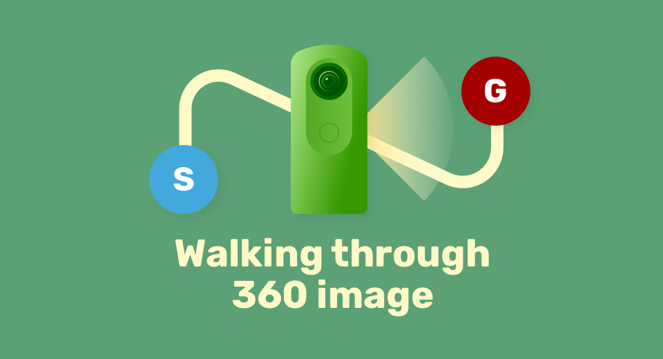
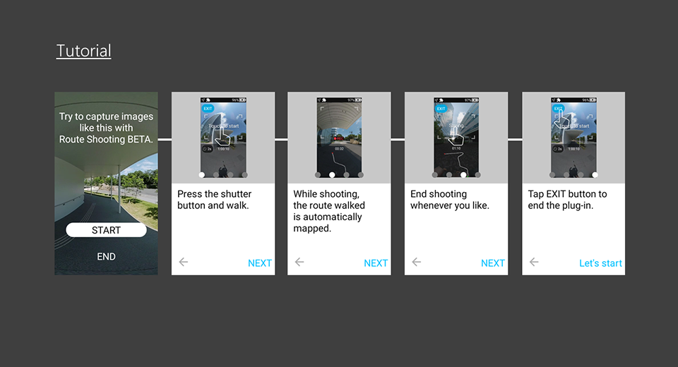
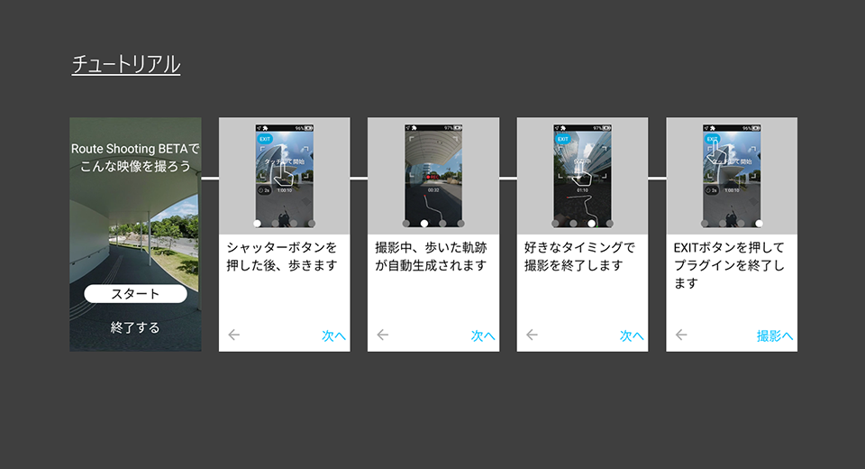

English(US) | [日本語](README.ja.md)

# Route Shooting BETA
Ricoh Company, Ltd.  
[Terms of Use](https://theta360.com/en/legal/terms_of_use_plugins/)

 

 <table>
  <tr>
   <td></td>
   <td></td>
   <td></td>
   <td></td>
  </tr>
 </table>

***

## Description
This plug-in generates videos showing the route the camera moved by shooting a 360° video while moving. Camera position information* detected with Visual SLAM technology is assigned to 360° videos. This provides a new video experience in 360° that differs from conventional playback methods. Playing back the shot video on the camera displays the route that the camera moved. The video can be viewed like a 360° hyperlapse video from the start to the goal or up to a selected point. This allows spatial movement to be experienced vicariously as well as simulated, which is perfect for conveying a sense of space that cannot be fully communicated with photographs.  

* Relative position information based on self-position estimation (this is not position information from a GNSS (Global Navigation Satellite System))  

• Videos may not be generated depending on the shooting environment and conditions.  
Click here for details [Link:https://topics.theta360.com/en/faq/c_08_x/8022/].  

[Operation method]  

– Startup  
Swipe left on the shooting screen of the camera to display the plug-in selection screen, and then tap “Route Shooting BETA”.  

– Shooting settings  
• Tap the self-timer button to select the countdown time between “OFF”, “2 seconds”, “5 seconds”, and “10 seconds”.  
• The video size is fixed at “4K (3840×1920), 15 fps”.  

– Shooting  
Press the shutter button or tap the frame near the center of the screen to begin shooting. Once shooting begins, start to move by walking with the camera. The camera recognizes the position from images so ensure that distinctive features in the surroundings continue to be captured in the video when moving. Press the shutter button or tap the frame near the center of the screen again to end shooting.

– Playback  
Tap the thumbnail that is displayed after shooting, or exit the plug-in and tap the view button in the single view at the playback screen. The movement route display, which is displayed during playback, can also be hidden by tapping the zoom-out button. Tap the “G” button to move the view to the shooting end point and the “S” button to move the view to the shooting start point. Tap the screen while the view is moving to stop it moving.  

## What's New

## Information
  * Updated：2024/09/30
  * Version：1.0.1
  * Requires：
    * RICOH THETA X (Firmware version 2.61.0)
  * Support：[RICOH Plugins](https://support.theta360.com/ja/)
  * Age Restriction：No

* The [RICOH THETA](https://support-theta.ricoh360.com/app-download) basic app for computer is required to install plugins
