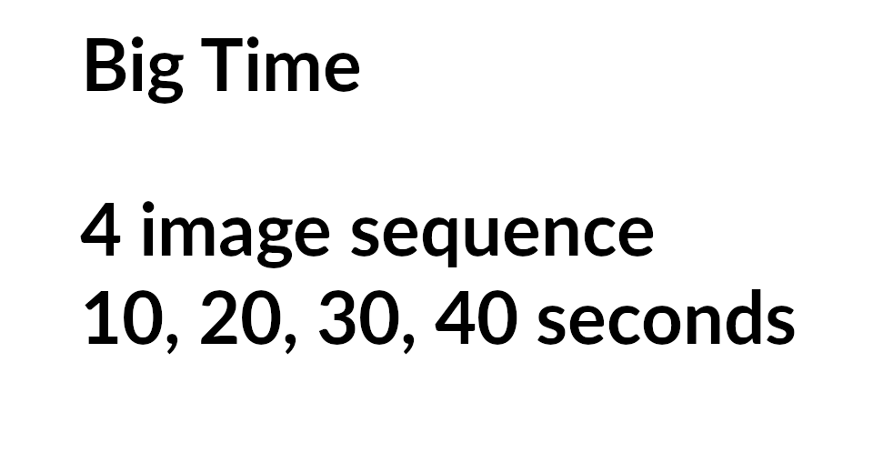

English(US) | [日本語](README.ja.md)

# bigtime
Matt Hotsinpillar  
[Privacy Policy](../../README.md#privacy-policy) | [Terms of Services](../../README.md#terms-of-services)

 

 <table>
  <tr>
   <td></td>
   <td></td>
   <td></td>
   <td></td>
  </tr>
 </table>

***

## Description
Sets self-timer delay for longer than 5 seconds.  
  
##Workflow  
Press shutter button and automatically take  
4 shots of the same scene. Throw away 3 shots after the shoot  
and keep the best one to use.  
  
##When To Use  
This is for people that don't want to use the mobile app and  
want to take a picture that doesn't include the photographer. A  
typical shot might be a mountain hike where you hide behind a tree.  
  
If you set the self-timer without the mobile app, the self-timer  
is set to 5 seconds. You will likely be in the shot.  
With Big Time, you can take 4 shots with  
one button press. After the first shot, the next three shots are  
spaced out by 10 seconds intervals. This should give you enough time to  
run out of the scene.  
  
##Features  
* 4 shots at 10, 20, 30, 40 seconds
* Wi-Fi LED will flash magenta when plug-in is on
* Audio prompt will sound 2.5 seconds before shot. LED will speed up
* LED speeds up faster 1.25 seconds before shot
  
  
## Information
  * Updated：2019/8/8
  * Version：1.0.0
  * Requires：
    * RICOH THETA V (Firmware version 2.50.1,3.00.1)
  * Support：[Partner Plugins](https://community.theta360.guide/t/matt-h-bigtime-long-timer-delay-plug-in/4638)
  * Age Restriction：No

* The [RICOH THETA](https://theta360.com/ja/about/application/pc.html#app-detail-01) basic app for computer is required to install plugins
