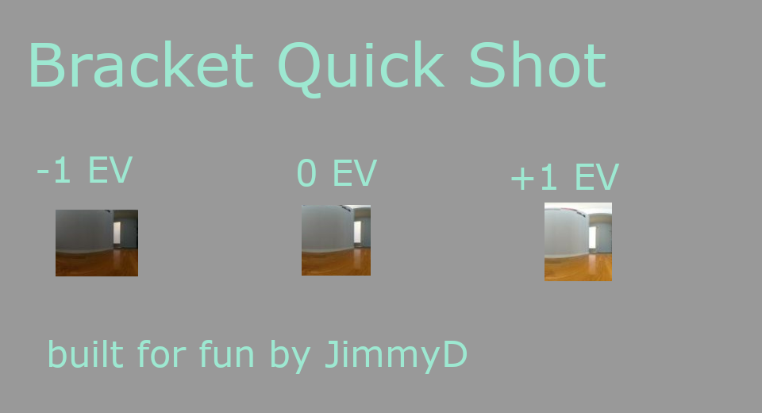
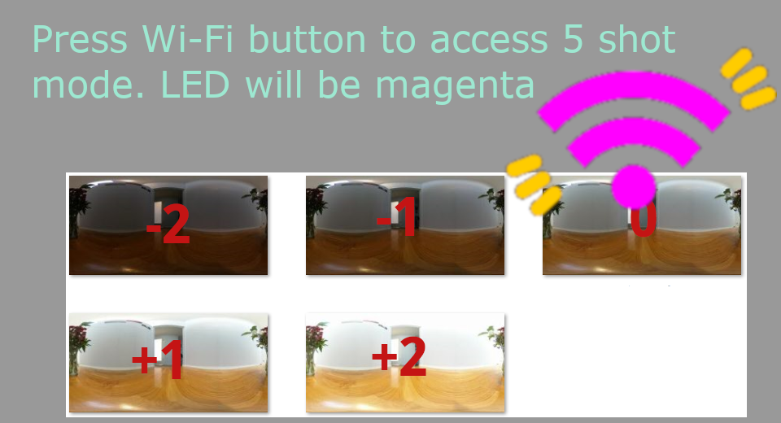
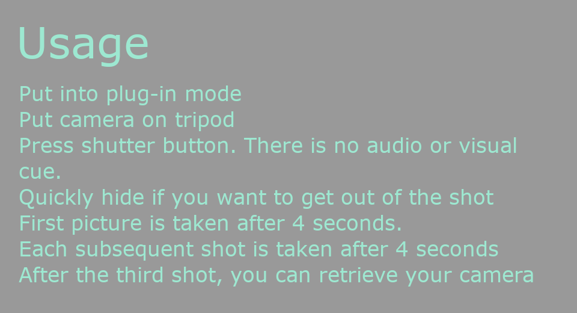

English(US) | [日本語](README.ja.md)

# Bracket Quick Shot

jimmieD  
[Terms of Use](https://www.apache.org/licenses/LICENSE-2.0.html)

<table><tr><td></td><td></td><td></td><td></td></tr></table>

## Description

Take 3 shots at different exposures.  
  
Workflow  
Press shutter button and automatically take 3 shots of the same scene at different exposures. Either throw away 2 shots after the shoot and keep the best one to use or combine all 3 shots into an HDR file with PhotoShop or the free software such Picturenaut or Luminance HDR.  
  
When To Use  
This is for people that don't want to use the mobile app to take bracketed shots. If you enjoy the experience of working only with the camera when you take a picture and not have to fiddle with the mobile app, Bracket Quick Shot will allow you to take three shots easily. It's intended that you go back home or to your studio after the shoot and experiment with different light and dark exposures at your computer using PhotoShop or other tools.  
  
Features  
Takes 3 shots  
Exposure Compensation (-1, 0, +1)  
Preserves image metadata  
Audio beep after each shot  
Wi-Fi LED flashes cyan when taking shots  
  
How to Use  
Put into plug-in mode  
Put camera on tripod  
Press shutter button. There is no audio or visual cue.  
Quickly hide if you want to get out of the shot  
First picture is taken after 4 seconds.  
Each subsequent shot is taken after 4 seconds  
After the third shot, you can retrieve your camera  
  
Other Tools to Consider Instead of 3 Bracket Quick Shot  
This is a niche tool for people that do not like having to bring out the mobile phone for quick shots. Consider other tools for your specific needs.  
  
If you want to create the HDR files inside the camera, check out HDR2EXR by Kasper. HDR2EXR also saves the original images at different exposures.  
  
The RICOH mobile app can also create a blended jpeg image from 3 files automatically. The mobile app can also take bracketed images.
  
5 Shot Feature  
If you press the Wi-Fi button on the side of the camera, 3 Bracket Quick Shot will take 5 images with exposure compensation of (-2, -1, 0, +1, +2). Press the Wi-Fi button again to set Lightside Darkside back to 3 images. When you first press the Wi-Fi side button, there's a small beep, but no visual indicator. When you are taking the 5 shots, the Wi-Fi LED will flash magenta.  
  
HDR  
Although 3 Bracket Quick Shot is designed for you to throw away 2 out of the 3 images and just keep one, you can use all three images in a single HDR file.  
  
The example below is using Luminance HDR.  
  
You can also create HDR files from all 5 images.  

  
## Information

- Updated: 2019/6/18
- Version: 1.0.0
- Requires:
  - RICOH THETA V (v2.50.1)
- Support: [Partner Plugins](https://community.theta360.guide/c/theta-api-usage/plugin)
- Age Restriction: No
