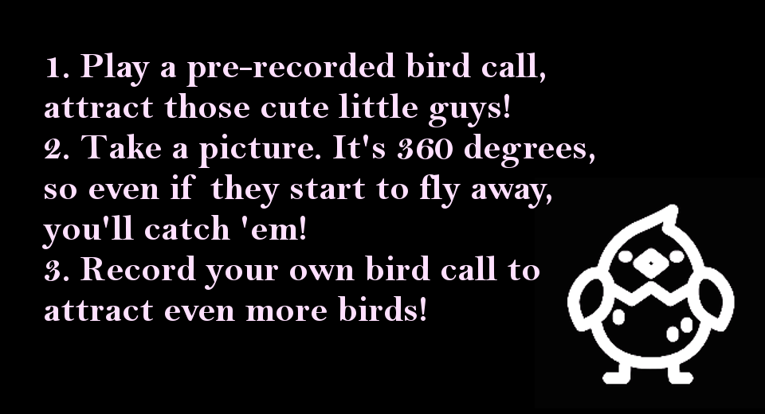
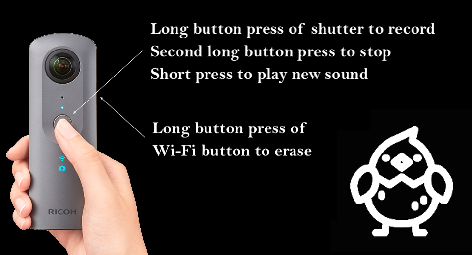
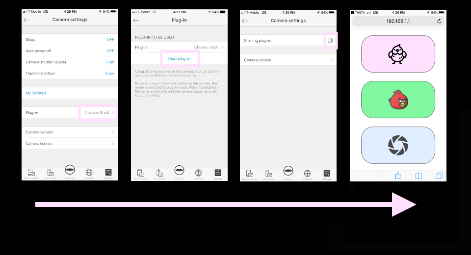
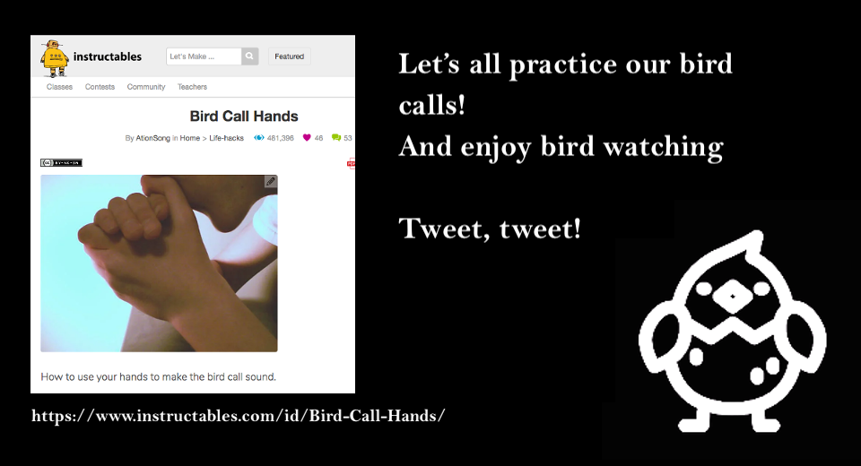

[English(US)](README.md) | 日本語

# Chicken Shot!
Chuck Pressman  
[プライバシーポリシー](../../README.ja.md#%E3%83%97%E3%83%A9%E3%82%A4%E3%83%90%E3%82%B7%E3%83%BC%E3%83%9D%E3%83%AA%E3%82%B7%E3%83%BC) | [利用規約](../../README.ja.md#%E5%88%A9%E7%94%A8%E8%A6%8F%E7%B4%84)

 
 <table>
  <tr>
   <td></td>
   <td></td>
   <td></td>
   <td></td>
  </tr>
 </table>

***

## 説明
This plug-in is called Chicken Shot! and it plays two different bird calls from the THETA internal speaker. It is intended for having use in a chicken pen or maybe outdoors in order to catch chickens or birds doing interesting things. The plug-in is controlled by a webpage with two buttons for the bird calls and one button for taking a picture. This makes it super simple and obvious to use, which is useful when you're trying to take bird pictures.  
  
Basically, there are three things you can do with this plug-in.  
  
* Play two different pre-recorded bird calls using the THETA speaker. Grab the bird's attention!
* Take a 360° picture. Candid shots are the best!
* Record your own voice using the mic in your THETA and use it the same way you were using the bird calls, to attract attention and take pictures.
  
Credits  
  
This plug-in is based on code used in Meow Shot! created by Hideki Shiro. Thank you Shiro-san!  
  
NanoHTTPD Copyright (c) 2012-2013 by Paul S. Hawke, 2001, 2005-2013 by Jarno Elonen, 2010 by Konstantinos Togias All rights reserved.  
  
theta-plugin-sdk Copyright 2018 theta4j project  
  
App icons are created by ICOOON MONO  
  
Bird icons made by Freepik from www.flaticon.com  
  

## 情報
  * 更新日：2019/2/22
  * バージョン：1.0.0
  * 要件：
    * RICOH THETA V （ファームウェア バージョン 2.50.1）
  * サポート：[Partner Plugins](https://community.theta360.guide/)
  * 年齢制限：なし

* プラグインをインストールするにはパソコン用基本アプリ [RICOH THETA](https://theta360.com/ja/about/application/pc.html#app-detail-01) が必要です
