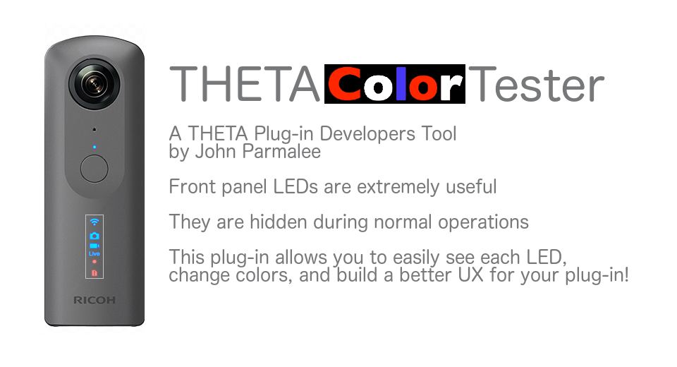
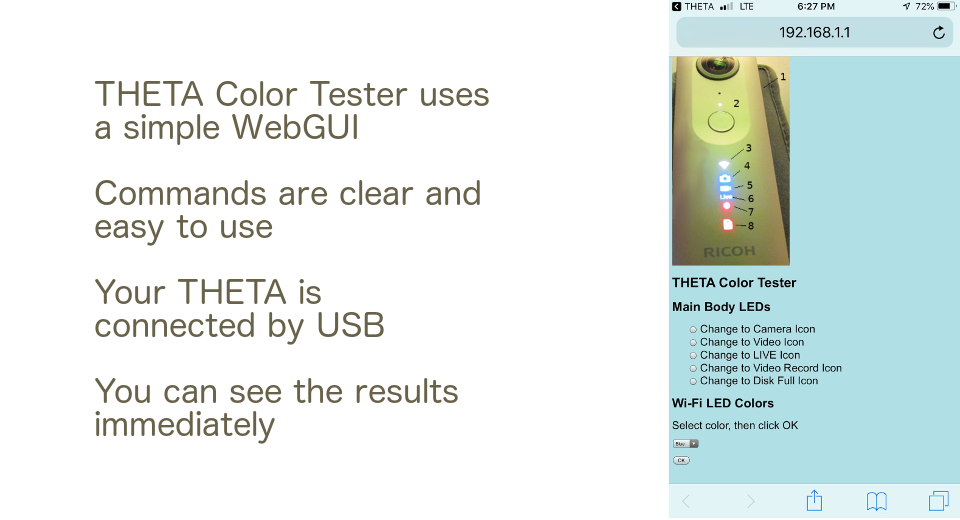
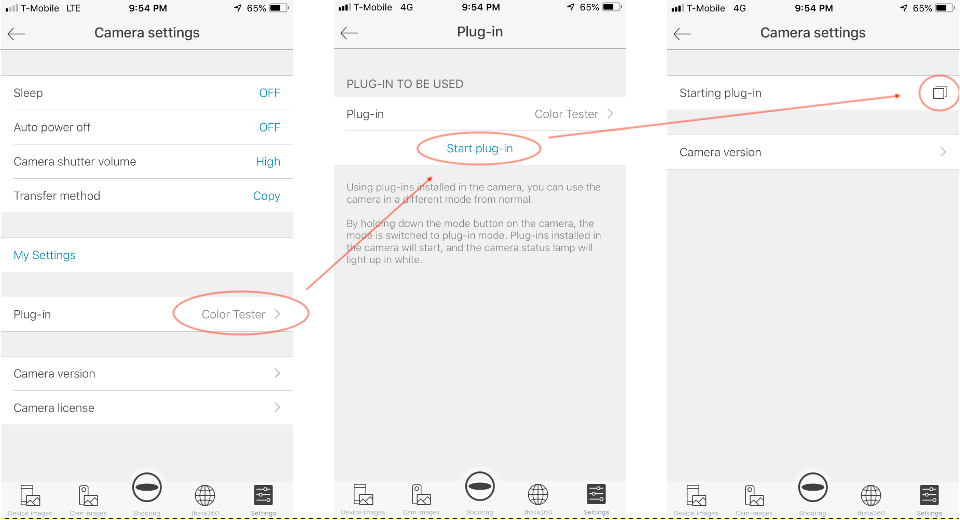
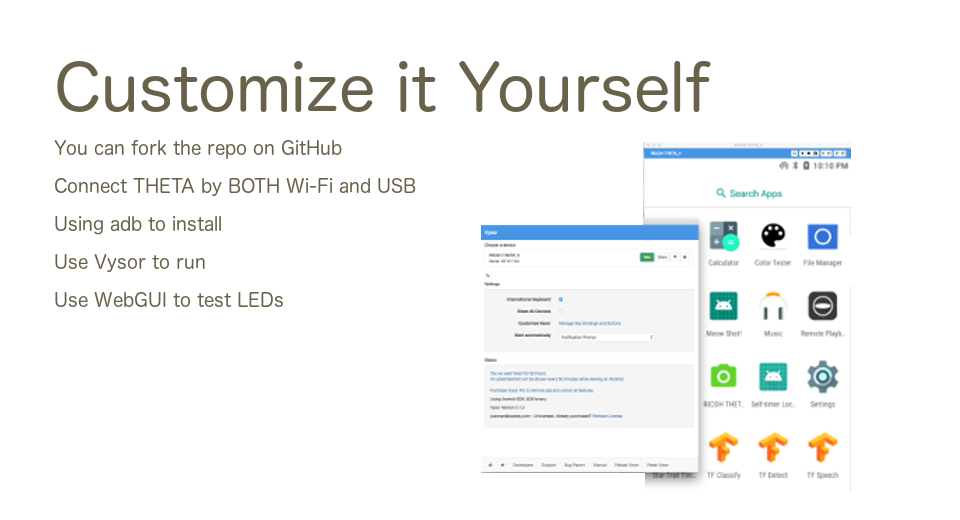

English(US) | [日本語](README.ja.md)

# Color Tester
John Parmalee  
[Privacy Policy](../../README.md#privacy-policy) | [Terms of Services](../../README.md#terms-of-services)

 

 <table>
  <tr>
   <td></td>
   <td></td>
   <td></td>
   <td></td>
  </tr>
 </table>

***

## Description
The THETA Color Tester Plug-in  
  
The RICOH THETA V development environment is extremely flexible and allows developers to use LEDs as they please. LEDs can communicate information about starting an action, a current action, ending an action, and more.  
  
This THETA V plug-in is intended to help other plug-in developers easily identify and test the LEDs on their THETA V. It allows you to turn on and off LEDs individually and and to change their colors.  
  
This plug-in is intended to help others. If you try it and want to add functionality, please contribute.  
  
Main Functionality  
Separately turn on and off the 5 main front LEDs  
* Camera Icon
* Video Icon
* Live Streaming Icon
* Video Recording Icon
* Disk Full Icon

  
Change the color of the Wi-Fi Icon  
* Blue
* White
* Red

  
Good luck using the THETA LEDs and creating you own unique interesting UX for the camera.  
  
  
## Information
  * Updated：2019/6/11
  * Version：1.0.4
  * Requires：
    * RICOH THETA V (Firmware version 2.50.1)
  * Support：[Partner Plugins](https://community.theta360.guide/)
  * Age Restriction：No

* The [RICOH THETA](https://theta360.com/ja/about/application/pc.html#app-detail-01) basic app for computer is required to install plugins
