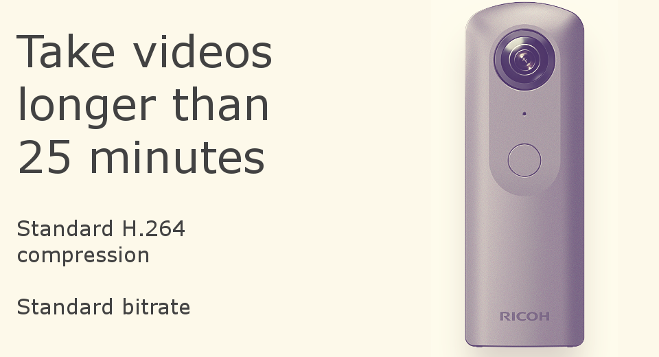

English(US) | [日本語](README.ja.md)

# Long Video Classic

codetricity360  
[Terms of Use](http://www.apache.org/licenses/LICENSE-2.0)

<table><tr><td></td><td></td><td></td><td></td></tr></table>

## Description

Save videos longer than 25 minutes. Uses standard H.264 compression and standard video bitrate. This is an alternative plug-in for people that have problems with the Long Video High Compression Plug-in that uses next-generation compression and non-standard bitrate. For people having problems with Long Video High Compression, this plug-in should work. It is only useful if you need to take a single video that is over 25 minutes and under 45 minutes. The plug-in supports single channel audio. Spatial audio does not work. Metadata is stripped out. You may need to inject metadata using a separate tool. The plug-in does not save camera orientation data to the video. See this document for more information: https://github.com/codetricity/longvideoclassic/blob/master/README.md

## What's New

Updated description for Plug-in.

## Information

- Updated: 2019/4/24
- Version: 1.1.0
- Requires:
  - RICOH THETA V (v2.50.1)
- Support: [Partner Plugins](https://community.theta360.guide/t/theta-v-long-video-plug-in-recording-beyond-25-minutes/3483)
- Age Restriction: No
