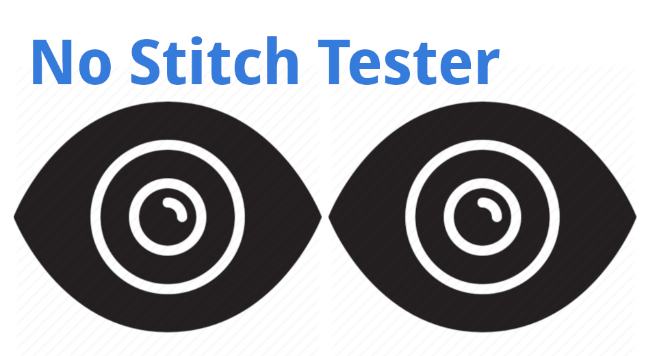

English(US) | [日本語](README.ja.md)

# No Stitch Tester
Leaning Len  
[Privacy Policy](../../README.md#privacy-policy) | [Terms of Services](../../README.md#terms-of-services)

 

 <table>
  <tr>
   <td></td>
   <td></td>
   <td></td>
   <td></td>
  </tr>
 </table>

***

## Description
Basic dual-fisheye plug-in to test the image and metadata of images taken with the RICOH 2.1 API. Before adding more advanced features into the plug-in, I wanted to put something out in the store that can take dual-fisheye pictures for testing in different applications so that I can get feedback on what features to add in another plug-in in the future.  
  
## Information
  * Updated：2019/6/20
  * Version：1.0.0
  * Requires：
    * RICOH THETA V (Firmware version 3.00.1)
  * Support：[Partner Plugins](https://community.theta360.guide/c/theta-api-usage/plugin)
  * Age Restriction：No

* The [RICOH THETA](https://theta360.com/ja/about/application/pc.html#app-detail-01) basic app for computer is required to install plugins
