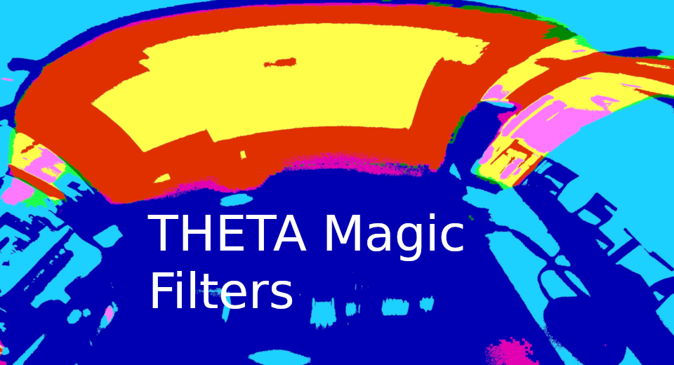
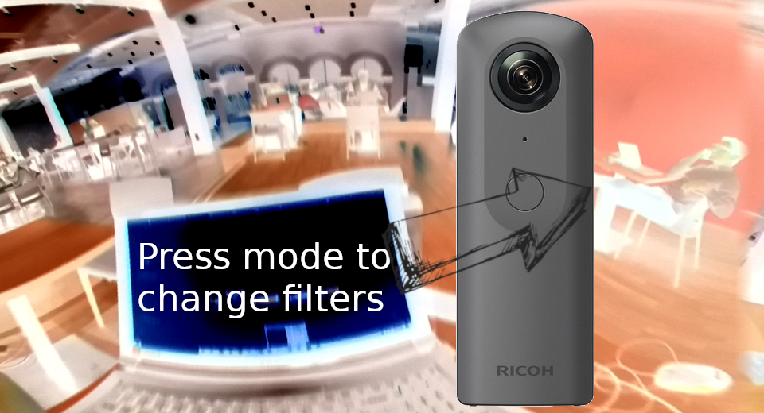
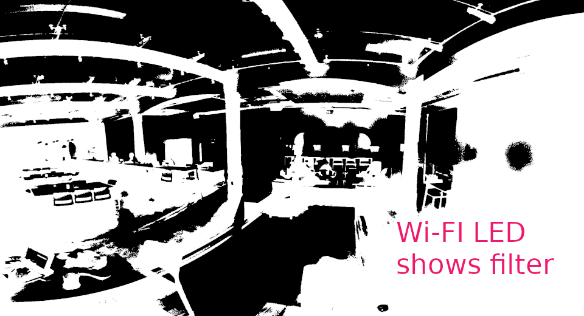

[English(US)](README.md) | 日本語

# Theta Magic Filters

Dream and Build  
[利用規約](https://opensource.org/licenses/MIT)

<table><tr><td></td><td></td><td></td><td></td></tr></table>

## 説明

Uses OpenCv to process images and generates interesting filters for the camera.  
  
Filters:  
  
Image Equalization (color).  
Binarization of image or Threshold (Red, Green and Blue).  
Grayscale.  
Blur.  
Erosion-Dilatation.  
Negative  
How it Works:  
Once activated, we can select the desired filter using the “Mode” button, depending on the color that the Wi-Fi symbol has, it will be the effect that will be applied to the image.  
  
Blue: Image Equalization (color).  
Green: Image Binarization or Threshold (Red, Green and Blue).  
Cyan: Grayscale.  
Magenta: Blur.  
Yellow: Erosion-Dilatation.  
White: Negative.  
Once the filter is selected, we only have to press the Shutter button to take the image and save it, the image will be saved in a folder called “Filtered Images”.  
Note: when the filter is being applied the WiFi symbol will flash, until it stops blinking. Do not press any other button, this process takes 1 - 4 seconds depending on the filter.  

## 情報

- 更新日: 2019/12/25
- バージョン: 1.0.0
- 要件:
  - RICOH THETA V (v3.06.1)
- サポート: [Partner Plugins](https://community.theta360.guide/t/theta-magic-filters-by-edoliver-victor-altamirano/4661)
- 年齢制限: なし
