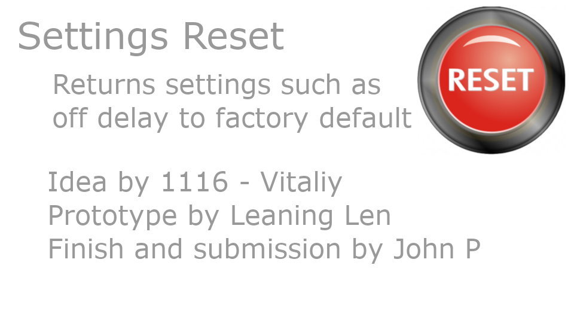
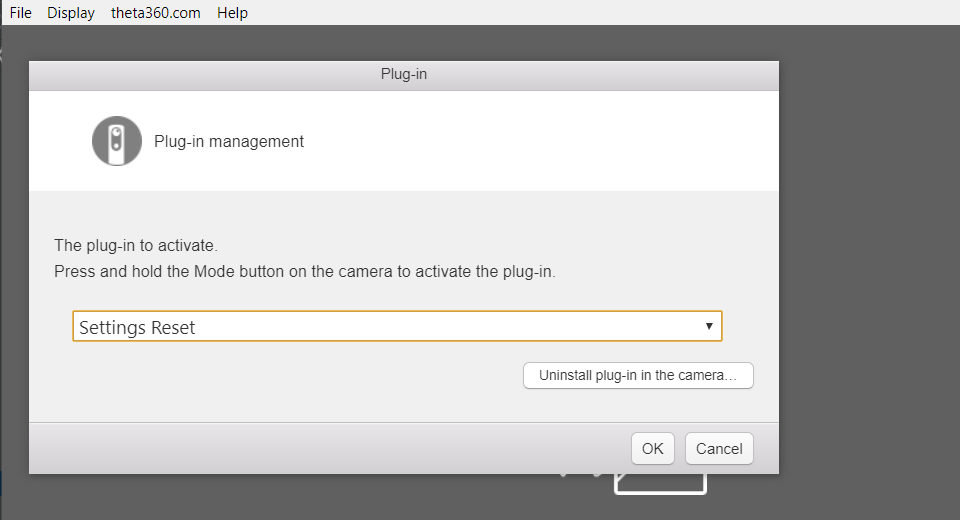

[English(US)](README.md) | 日本語

# Settings Reset

John Parmalee  
[利用規約](https://www.apache.org/licenses/LICENSE-2.0)

<table><tr><td></td><td></td><td></td><td></td></tr></table>

## 説明

DANGER - This will delete all your settings. To be safe, backup your media before use.  
  
Background and When to Use  
.guide community member 1116, Vitaliy, requested this plug-in be built to reset the offDelay setting. He was having problems with the Android Mobile app failing to work effectively with the RICOH THETA V.  
  
Using the camera.reset command worked from Postman, but was difficult to use. Please read this topic: https://community.theta360.guide/t/building-a-plug-in-for-factory-reset/4505  
  
How To Use  
Prior to using this plug-in you must first use the RICOH desktop or mobile app and select Settings Reset under Plug-in Management.  
  
Press the side Wi-Fi button to perform a settings reset.  
  
the Wi-Fi LED will turn red briefly  
there will be a short audio chirp  
the camera will reboot  
  
Credits  
This plug-in was built by Leaning Len and John P in one day as a way to learn about plug-in development and help out the community with a simple utility. Idea for the plug-in and background information provided by 1116 - Vitaliy.  

## 情報

- 更新日: 2019/6/18
- バージョン: 1.0.0
- 要件:
  - RICOH THETA V (v3.00.1)
- サポート: [Partner Plugins](https://community.theta360.guide/t/plug-in-for-factory-reset/4505)
- 年齢制限: なし
