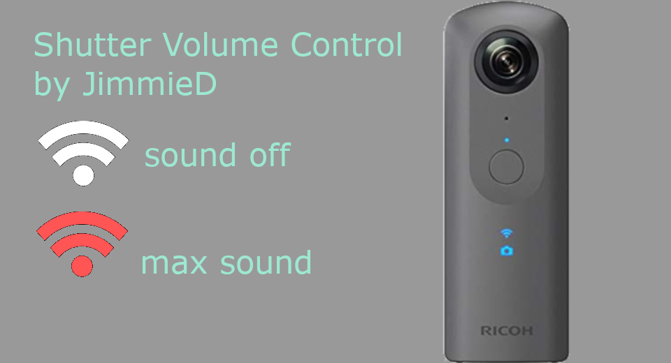
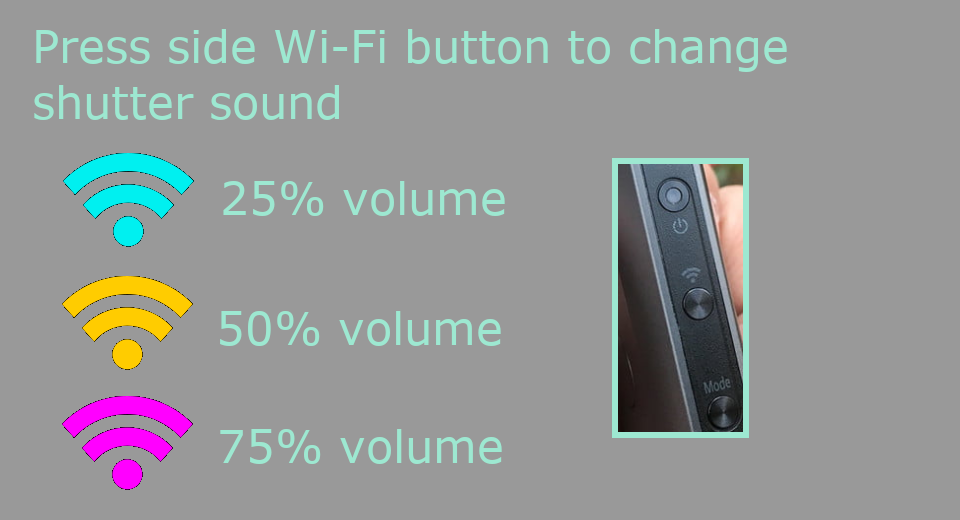
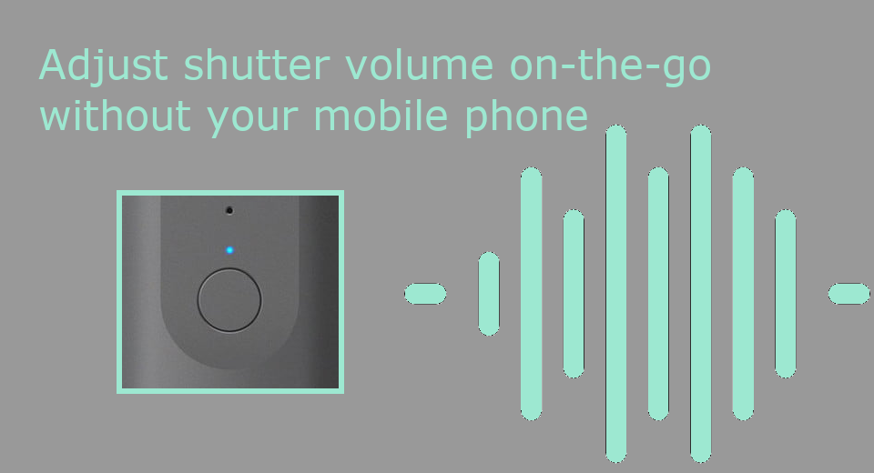

English(US) | [日本語](README.ja.md)

# Shutter Volume Control

jimmieD  
[Terms of Use](https://www.apache.org/licenses/LICENSE-2.0.html)

<table><tr><td></td><td></td><td></td><td></td></tr></table>

## Description

Adjust shutter volume without the use of your mobile phone. This could be especially useful if you have problems connecting your mobile phone to the THETA or your don't have your mobile phone with you, but can connect your laptop to the THETA with a USB cable to manage plug-ins.  
  
Usage  
Press Wi-Fi button to cycle between 4 pre-set shutter volumes.  
Plays sample shutter sound. Does not take picture.  
Exit plug-in to save shutter volume.  
LED Explanation  
White LED: sound chirp when set. Shutter Sound Off.  
Cyan LED: 25% volume  
Yellow LED: 50% volume  
Magenta LED: 75% volume  
Red LED: maximum volume  

## Information

- Updated: 2019/6/17
- Version: 1.0.0
- Requires:
  - RICOH THETA V (v2.50.1)
- Support: [Partner Plugins](https://community.theta360.guide/t/james-donahowers-shutter-volume-plug-in/4495)
- Age Restriction: No
