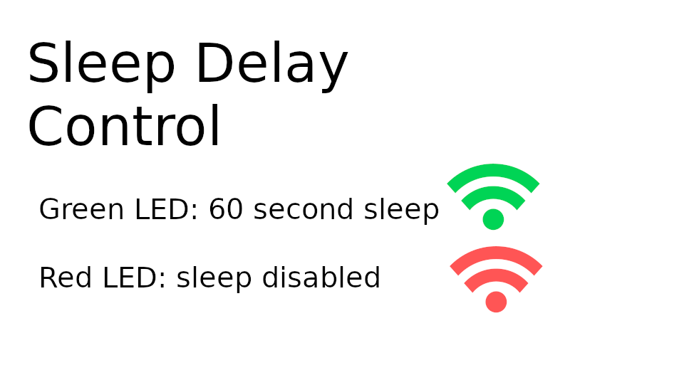

[English(US)](README.md) | 日本語

# Sleep Delay Control
Chuck Pressman  
[利用規約](https://www.apache.org/licenses/LICENSE-2.0)

 
 <table>
  <tr>
   <td></td>
   <td></td>
   <td></td>
   <td></td>
  </tr>
 </table>

***

## 説明
Disables sleep with one button press and then enables sleep with a single button press. You do not need to use the mobile app to adjust Sleep Mode.  
  
Although it's easy to turn off sleep mode with the mobile app, it is sometimes a hassle to bring it out. Also,
if sleep mode is left off, it's easy to drain the battery completely.  
  
The solution is to make it super-easy to turn off sleep mode and super-easy to turn it back on.  
  
Use cases:  
* you are taking a timelapse and want to turn off sleep mode, then quickly turn it back on when the
timelapse is finished.
* You are developer and want to turn off sleep quickly during testing without having to connect the mobile app or send an raw API command. In this workflow, your THETA V is already connected to the USB cable and it is easy to switch the plug-in.
* You are live streaming through the USB cable and want to turn off sleep quickly.
  
Usage  
* Put into plug-in mode
* Press Wi-Fi button on side of camera
* Green LED indicates 60 second sleep
* Red LED indicates sleep is disabled
  
## 情報
  * 更新日：2019/7/17
  * バージョン：1.0.0
  * 要件：
    * RICOH THETA V （ファームウェア バージョン 2.50.1）
  * サポート：[Partner Plugins](https://community.theta360.guide/c/theta-api-usage/plugin)
  * 年齢制限：なし

* プラグインをインストールするにはパソコン用基本アプリ [RICOH THETA](https://theta360.com/ja/about/application/pc.html#app-detail-01) が必要です
