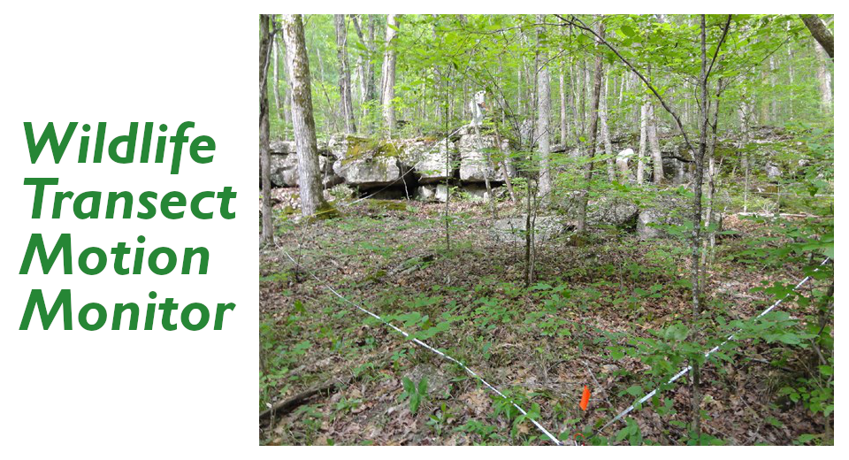
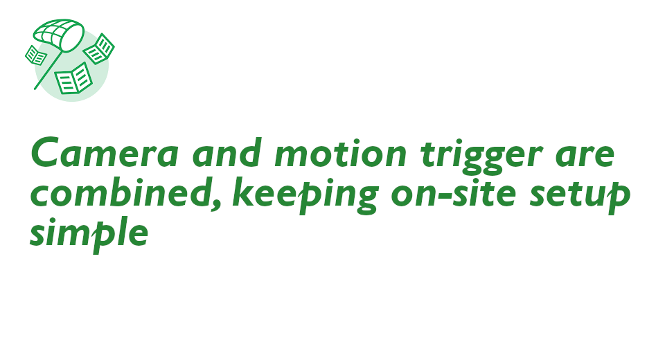

[English(US)](README.md) | 日本語

# Transect Motion Monitor
michaelsfbay  
[利用規約](https://www.apache.org/licenses/LICENSE-2.0.txt)

 
 <table>
  <tr>
   <td></td>
   <td></td>
   <td></td>
   <td></td>
  </tr>
 </table>

***

## 説明
In scientific studies of the environment, transects are placed in areas such as forests. In each transect, sensors such as temperature are placed that record data to either a local device or a connected data. As the transects are often remote, we collect visual data.  
  
This plug-in triggers a picture when there is high wind in the area of the transect which could disrupt the sensors.  
  
Picture will trigger once THETA is moved by either pitch or roll by a threshold. Currently set to +/- 0.8.  
  
Example Mounting  
Attach camera mount to end of 2 meter fiberglass rod. Inexpensive bicycle flag poles can be used.  
Mount is a 1/4" by 20tpi threaded bolt and can be tied to the fiberglass rod and secured with epoxy.  
Use extension to enable THETA to be powered by USB cable  
Thread styrofoam block through the rod and place it under the camera. The styrofoam block catches the wind.  
  
  
## 情報
  * 更新日：2019/6/17
  * バージョン：1.0.4
  * 要件：
    * RICOH THETA V （ファームウェア バージョン 2.50.1）
  * サポート：[Partner Plugins](https://community.theta360.guide/t/wildlife-transect-motion-monitor-by-michael-li/4492)
  * 年齢制限：なし

* プラグインをインストールするにはパソコン用基本アプリ [RICOH THETA](https://theta360.com/ja/about/application/pc.html#app-detail-01) が必要です
