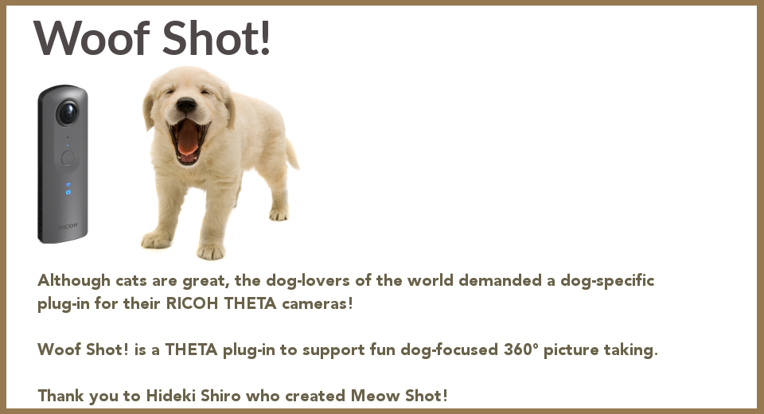
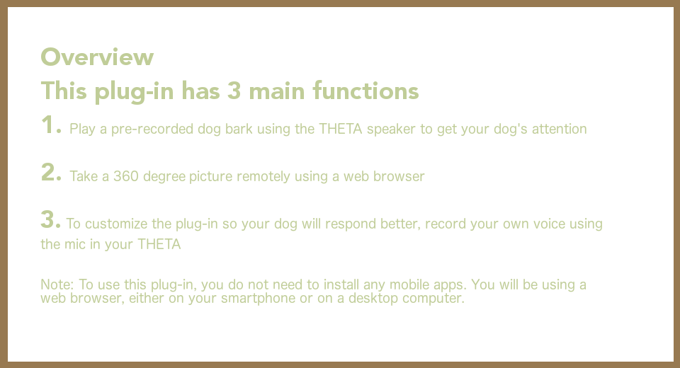
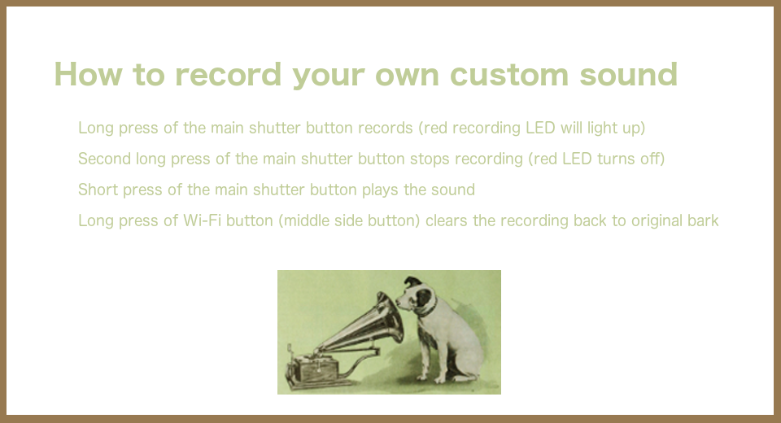
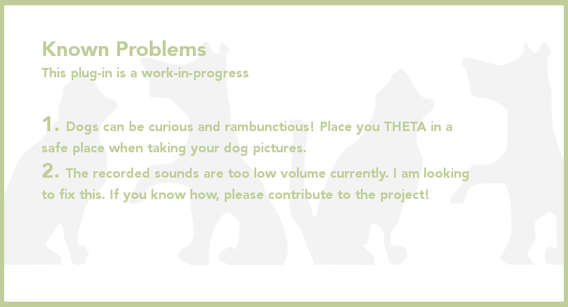

English(US) | [日本語](README.ja.md)

# Woof Shot!
Matt Hotsinpillar  
[Terms of Use](http://www.apache.org/licenses/LICENSE-2.0)

 

 <table>
  <tr>
   <td></td>
   <td></td>
   <td></td>
   <td></td>
  </tr>
 </table>

***

## Description
Woof Shot!  
  
Woof Shot! is a THETA plug-in to support fun dog-focused 360° picture taking.  
Although cats are great, the dog-lovers of the world demanded a dog-specific plug-in for their RICOH THETA cameras! Dogs are great, too!  
Get your dog's attention by making the camera emit a bark and then take their picture.  
  
This plug-in has three commands:  
* Play a pre-recorded dog bark using the THETA speaker.
* Take a 360° picture remotely using a web browser.
* To customize the plug-in so your dog will respond better, record your own voice using the mic in your THETA.
  
To use this plug-in, you do not need to install any mobile apps. You will be using a web browser, either on your smartphone or on a desktop computer.  
  
Credit: This plug-in has been modified from Meow Shot! by Hideki Shiro  
  
Have fun with your doggy friend!  

## Information
  * Updated：2019/4/10
  * Version：1.0.0
  * Requires：
    * RICOH THETA V (Firmware version 2.50.1)
  * Support：[Partner Plugins](https://theta360.guide/)
  * Age Restriction：No

* The [RICOH THETA](https://theta360.com/ja/about/application/pc.html#app-detail-01) basic app for computer is required to install plugins
