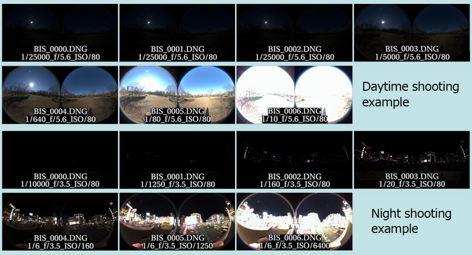

[English(US)](README.md) | 日本語

# Burst-IBL-Shooter

CGSLAB  
[利用規約](https://site.cgslab.info/services/burst-ibl-shooter)

<table><tr><td></td><td></td><td></td><td></td></tr></table>

## 説明

このプラグインは、VFXで使用するIBL(HDRI)作成用のブラケット撮影を1秒未満で行なえます。  
設定不要でほぼ全てのライティング環境に対応でき、明るい環境では、手持ち撮影も可能です。  
  
Camera APIのBurst Capture Modeを使用してます。  
自動露出から-5EVオフセットを基準に±3EVステップで7枚撮影されます。  
暗い屋内から明るい屋外まで、ブラケット撮影を適切に行うことができます。  
  
Mode/Fn Buttonを押すことで即撮影とセルフタイマーモードを選択できます。  
モード1：Now Shoot：即座に撮影が行われます。  
モード2：(3Sec)Sound SelfTimer：3秒間のセルフタイマー音の後に撮影されます。→♪P-P-PP>撮影  
モード3：(7Sec)Sound SelfTimer：7秒間のセルフタイマー音の後に撮影されます。→♪P-P-P-P-P-P-PP>撮影  
  
RAWデータ(DNG)のみの保存となります。  
撮影後、画像の書き込みに20秒程度かかりますが、カメラを動かしても問題ありません。  
この際に「WRITEING .DNG FILE. CAN MOVE THETA. | Dont Shoot!」の文章が表示されます。  
書き込み完了後に「BURST-IBL-SHOOTER V1.2 | CAN SHOOT!」の文章が表示され書き込み完了音が鳴り再撮影が可能になります。  
※直前の撮影モードの状態になっています。  
  
ブラケット順序が [0 > - > +]から[- > 0 > +]になるよう設定が変更されました。  
この変更によって、書き出される連番画像は露出順序通りとなりました。  
  
Burst_IBL_Shooterフォルダに日時でフォルダ分けして保存されるためデータの管理が行いやすいです。  
撮影環境によって重複設定で撮影された画像が生成される場合があります。  
  
公式のリモートコントロールプラグインとの併用で対応のBluetooth Remote Controlで遠隔撮影が可能です。  
  
品質や処理時間の問題から、内部でHDRIに変換する予定はありません。ACESに準拠したHDRIの作成方法はこちらをご覧ください。(日本語のみ)  
https://cgworld.jp/regular/theta_z1/  

## 新機能

ブラケット順序が [0 > - > +]から[- > 0 > +]になるよう設定が変更されました。  
この変更によって、書き出される連番画像は露出順序通りとなりました。  

## 情報

- 更新日: 2024/5/21
- バージョン: 1.2.0
- 要件:
  - RICOH THETA Z1 (v2.10.3, v2.11.1, v2.20.3, v2.30.1, v3.01.1, v3.10.2)
- サポート: [Partner Plugins](http://site.cgslab.info/)
- 年齢制限: なし
