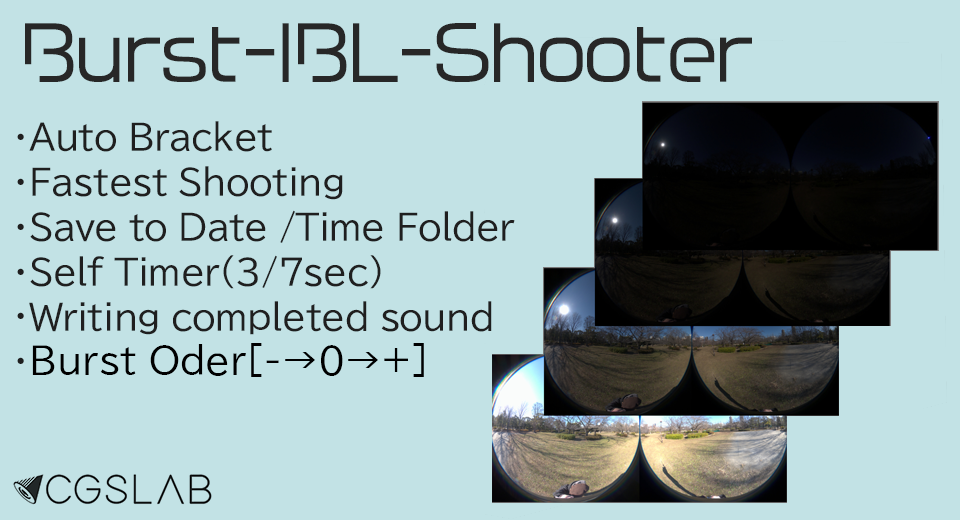

English(US) | [日本語](README.ja.md)

# Burst-IBL-Shooter
CGSLAB  
[Terms of Use](https://site.cgslab.info/services/burst-ibl-shooter)

 

 <table>
  <tr>
   <td></td>
   <td></td>
   <td></td>
   <td></td>
  </tr>
 </table>

***

## Description
Burst Capture Mode of Camera API is used.  
Seven shots are taken in ±3EV steps based on a -5EV offset from the auto exposure.  
Bracketed shots can be taken properly from dark indoors to bright outdoors.  
  
Pressing the Mode/Fn Button allows you to select between instant shooting and self-timer mode.  
Mode 1: Now Shoot: The picture is taken immediately.  
Mode 2: (3Sec)Sound SelfTimer: The picture will be taken after 3 seconds of self-timer sound. →♪P-P-P-PP>Shooting  
Mode 3: (7Sec)Sound SelfTimer: The picture will be taken after 7 seconds of self-timer sound. →♪P-P-P-P-P-P-P-PP>Shooting  
  
Only RAW data (DNG) will be saved.  
After shooting, it takes about 20 seconds to write the image, but you can move the camera.  
At this time, the text "WRITEING .DNG FILE. CAN MOVE THETA. | Dont Shoot!"  
After writing is complete, the text "BURST-IBL-SHOOTER V1.2 | CAN SHOOT!" will be displayed and a write completion sound will sound, allowing the camera to resume shooting.  
*The state of the photo mode was taken just before.  
  
Bracket order has been changed from [0 > - > +] to [- > 0 > +].  
As a result of this change, the exported sequentially numbered images now follow the exposure order.  
  
The data is saved in the Burst_IBL_Shooter folder, organized by date and time for easy data management.  
Depending on the shooting environment, duplicate images may be generated.  
  
Remote shooting is possible with the compatible Bluetooth Remote Control when used with the official remote control plug-in.  
  
There are no plans to internally convert to HDRI due to quality and processing time issues. See here for an ACES-compliant HDRI creation method. (JapaneseOnry)  
https://cgworld.jp/regular/theta_z1/

## What's New
Bracket order has been changed from [0 > - > +] to [- > 0 > +].  
As a result of this change, the exported sequentially numbered images now follow the exposure order.  

## Information
  * Updated：2024/5/21
  * Version：1.2.0
  * Requires：
    * RICOH THETA Z1 (Firmware version 2.10.3, 2.11.1, 2.20.3, 2.30.1, 3.01.1, 3.10.2)
  * Support：[Partner Plugins](http://site.cgslab.info/)
  * Age Restriction：No

* The [RICOH THETA](https://theta360.com/ja/about/application/pc.html#app-detail-01) basic app for computer is required to install plugins
