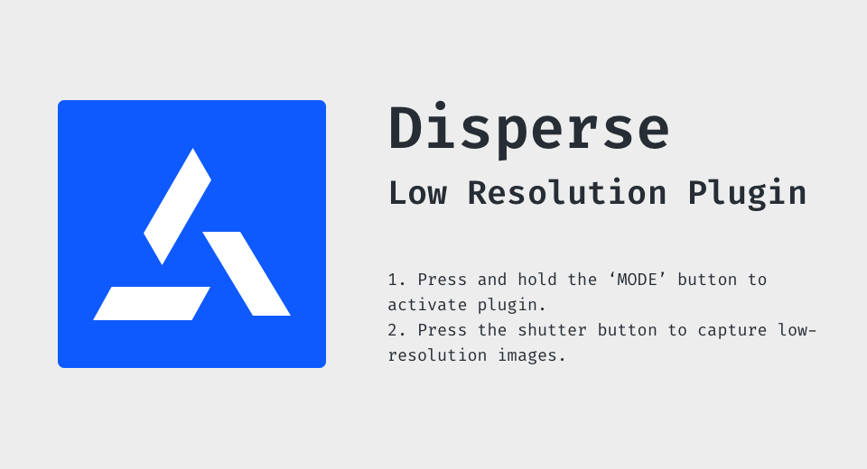
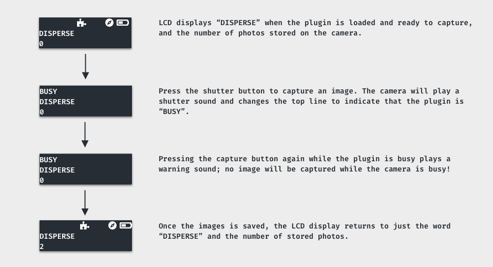

[English(US)](README.md) | 日本語

# Disperse Low-Resolution Plugin
Disperse  
[プライバシーポリシー](../../README.ja.md#%E3%83%97%E3%83%A9%E3%82%A4%E3%83%90%E3%82%B7%E3%83%BC%E3%83%9D%E3%83%AA%E3%82%B7%E3%83%BC) | [利用規約](../../README.ja.md#%E5%88%A9%E7%94%A8%E8%A6%8F%E7%B4%84)

 
 <table>
  <tr>
   <td></td>
   <td></td>
   <td></td>
   <td></td>
  </tr>
 </table>

***

## 説明
The Disperse Low-Resolution Plugin for Ricoh Theta Z1 increases compression of images captured by the Theta Z1 down to ~2MB per image without impacting the camera's battery life or performance.

## 新機能
This version of the plugin lets you "queue up" multiple captures, and displays the number of captures saved so far on the device's LCD.

## 情報
  * 更新日：2022/2/3
  * バージョン：0.0.2
  * 要件：
    * RICOH THETA Z1 （ファームウェア バージョン 2.00.1）
  * サポート：[Partner Plugins](https://disperse.io/)
  * 年齢制限：なし

* プラグインをインストールするにはパソコン用基本アプリ [RICOH THETA](https://theta360.com/ja/about/application/pc.html#app-detail-01) が必要です
