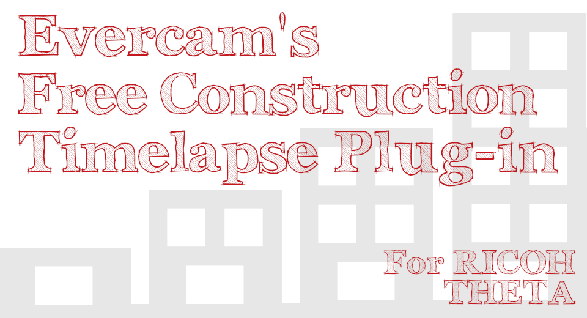
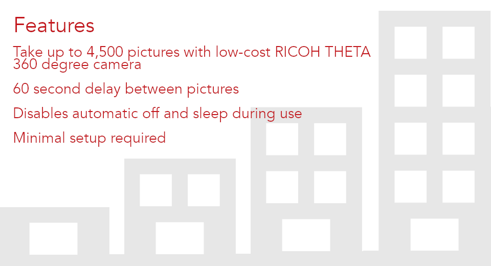
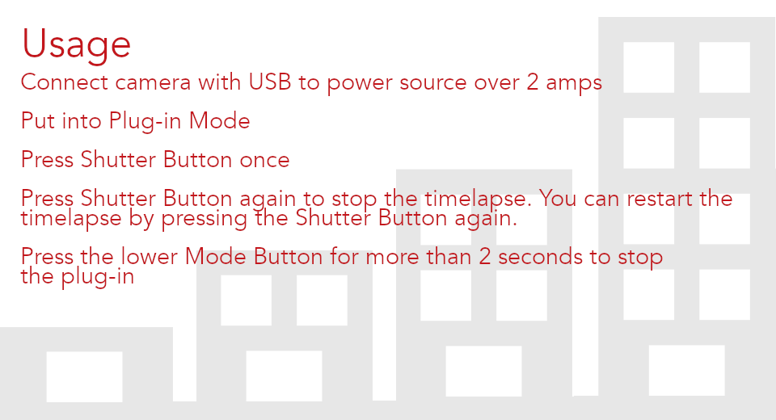
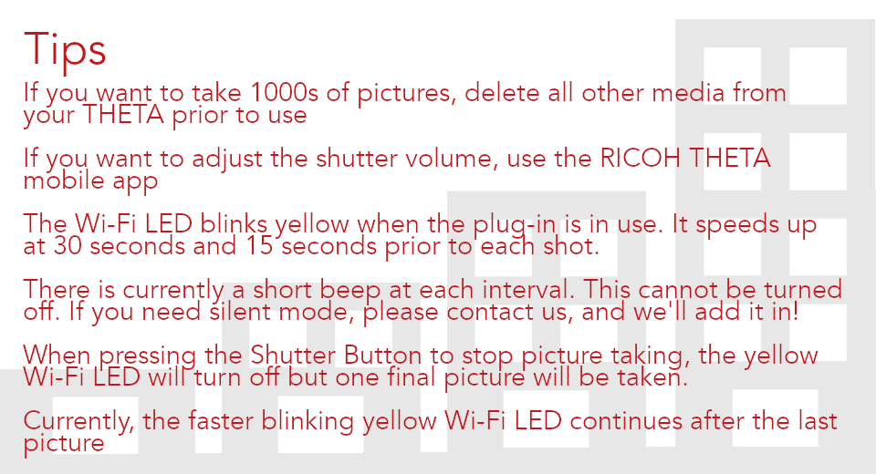

English(US) | [日本語](README.ja.md)

# Evercam Open Source Timelapse

Marco Herbst  
[Terms of Use](https://www.apache.org/licenses/LICENSE-2.0.txt)

<table><tr><td></td><td></td><td></td><td></td></tr></table>

## Description

Free and open source construction timelapse plug-in from the team at Evercam (https://evercam.io/)  
Take up to 4,500 timelapse pictures with your RICOH THETA. Enables switching between timelapse and single still image mode without the use of a mobile phone. Features - 60 second delay between pictures; Disables automatic off and sleep during use. Benefits - Does not require mobile phone; Can switch back to single shot mode by pressing the lower mode button to take camera out of plug-in mode; Open source.  
  
This plug-in is intentionally simple, allowing developers to use this open source project as a base for their customized construction workflows.  
  
Join the movement to bring 360 image technology into the construction industry. Contributions and modifications to our GitHub project are welcome. https://github.com/theta360developers/evercam-construction-timelapse  

## Information

- Updated: 2019/6/10
- Version: 1.0.0
- Requires:
  - RICOH THETA V (v2.50.1)
- Support: [Partner Plugins](https://community.theta360.guide/t/evercam-open-source-construction-timelapse/4480)
- Age Restriction: No
