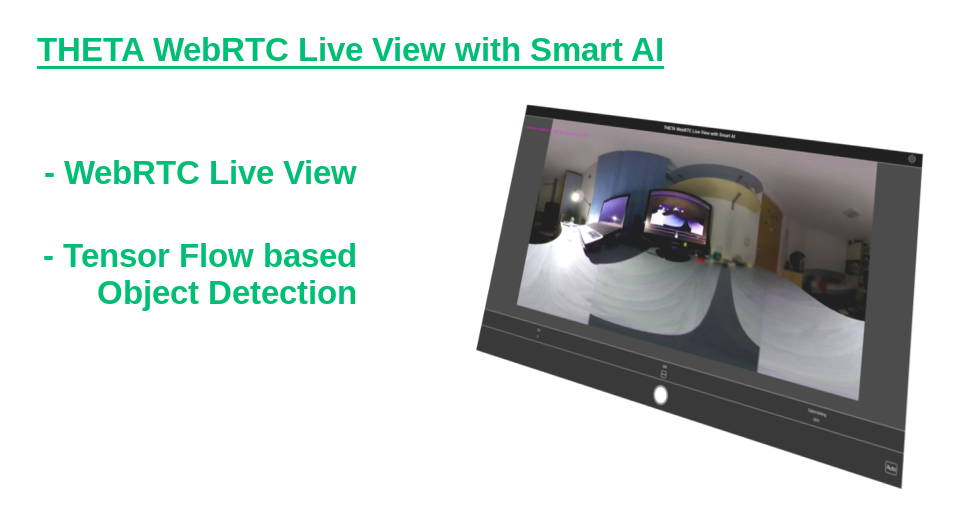

English(US) | [日本語](README.ja.md)

# Live View with Smart AI
Tokes Attila  
[Terms of Use](https://sites.google.com/view/thetav-smart-live-view-360/terms-of-use)

 

 <table>
  <tr>
   <td></td>
   <td></td>
   <td></td>
   <td></td>
  </tr>
 </table>

***

## Description
The plugin provides a WebRTC based 360° Live View, with Smart Object Detection implemented using TensorFlow.

## Information
  * Updated：2019/9/18
  * Version：1.0.0
  * Requires：
    * RICOH THETA V (Firmware version 3.00.1)
  * Support：[Partner Plugins](https://sites.google.com/view/thetav-smart-live-view-360)
  * Age Restriction：No

* The [RICOH THETA](https://theta360.com/ja/about/application/pc.html#app-detail-01) basic app for computer is required to install plugins
